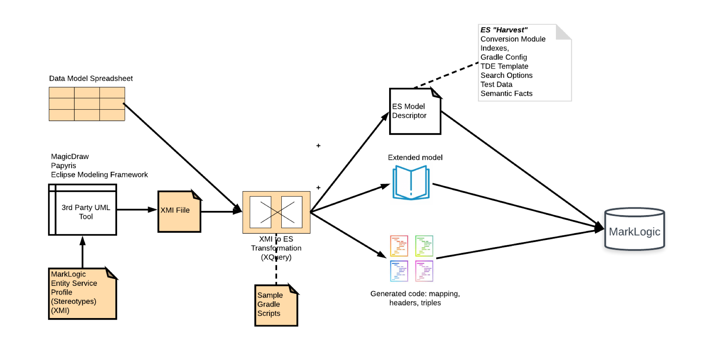

# UML to Entity Services Toolkit

## Intro

UML2ES is a toolkit to support modeling MarkLogic data in UML and mapping that UML model to Entity Services. For background, refer to the following blog posts:

- <http://www.marklogic.com/blog/how-to-model-manage-entities-uml/>
- <http://developer.marklogic.com/blog/uml-modeling-marklogic-entity-services>
- <http://developer.marklogic.com/blog/uml-modeling-marklogic-entity-services-semantics>

Also watch the following video (it's a little out of date):

- <https://www.youtube.com/watch?v=VkpH3LgMz3M&feature=youtu.be>

UML2ES works like this:

You use a third-party UML tool, along with a set of MarkLogic stereotypes, to build a data model. (If you don't have a UML tool or prefer spreadsheets, you can design your model in Excel instead!) The toolkit helps you use that model in MarkLogic. It does this by transforming your model to MarkLogic's Entity Services form; you can use gradle to include this transformation as part of your build. Once in Entity Services form, your model can be used to generate all sort of useful code to ensure that the data in MarkLogic conforms to your model. 

## What's In It?
The toolkit consists of the following parts:
- [uml2esTransform](uml2esTransform): MarkLogic server-side modules to map UML to Entity Services, plus a UML-to-ES gradle build file to incorporate into your build. The transform also generates code to build XML or JSON documents whose structure follows that of the model. If you are a Data Hub Framework shop, the transform can generate harmonization modules!
- [umlProfile](umlProfile): A UML profile containing stereotypes for MarkLogic Entity Services. Use this profile to include Entity Services configuration to your UML model.
- [excel](excel): You can build your model in Excel as an alternative to UML! Maybe we should rename this toolkit *Excel2ES*! The toolkit provides an [Excel template](excel/uml2es-excel-template.xlsx) for this purpose. See [examples/hrexcel](examples/hrexcel) for a detailed example of how to use it. Also included is a [mapping spreadsheet](excel.uml2es-excel-mapping-template.xlsx). See [tutorials/employeeCradleToGrave.md](tutorials/employeeCradleToGrave.md) and [examples/hr](examples/hr) for detailed examples of how to use it. 
- [tutorials](tutorial): Step-by-step tutorials on how to use UML2ES ranging from simple -- [tutorials/papyrus_model_edit.md](tutorials/papyrus_model_edit.md) -- to epic: [tutorials/employeeCradleToGrave.md](tutorials/employeeCradleToGrave.md).
- [examples](examples): Numerous examples showing the use of UML (and Excel) data models for MarkLogic and its Data Hub framework. 

## How We Expect You Will Use This Toolkit
As a user, you want to design a data model using UML and then ingest data into MarkLogic that conforms to this model. Put differently, you plan to put significant data into MarkLogic and want to ensure that the structure of this data follows a well considered model. 

If that's you, we think this toolkit is for you. You will need the following ingredients:

- A **third-party UML tool** that supports XMI 2.x export and UML profiles with tagged values. In the examples provided in this toolkit we use MagicDraw, Eclipse EMF, and Papyrus. Here are some useful tutorials showing the use of our toolkit with these tools: [Tool how-to's](tutorials/README.md).
- The **UML profile for MarkLogic**, provided in the [umlProfile](umlProfile) folder of this toolkit. You import this profile into your UML toolkit and then proceed to apply stereotypes from the profile to your classes and attributes. Using a stereotype, you can designate that a specific attribute should have a range index in MarkLogic, for example. A reference guide to these stereotypes is in [docs/README.md](docs/README.md).
- A **transform module** to map your UML model to a form understood by MarkLogic: the Entity Services model. This module, written in XQuery, is in the [uml2esTransform](uml2esTransform) folder of this toolkit. There is a two-step process to using this module. First, you export your UML model to XMI (that's short for XMI Metadata Interchange); your UML tool needs to support that feature. Second, you pass in your XMI as input to the transform; it ouputs a JSON Entity Services model descriptor. Don't worry; the examples in this toolkit show how to call the transform and where it fits in your build-deploy-ingest workflow.
- A **build-deploy-ingest framework** to deploy your UML model to MarkLogic and ingest source data into MarkLogic in the form prescribed by the model. In other words, you need for your UML model to be more than a picture; you need MarkLogic code that shapes your data to fit the model. This toolkit provides several examples of a gradle-based approach. We recommend you take one of these examples as your starting point, tailoring it for your needs.

## Where To Begin
Start with the [tutorials](tutorials). If want to build a really simple model and see it through to MarkLogic, try [tutorials/papyrus_model_edit.md](tutorials/papyrus_model_edit.md) or [tutorials/magicdraw_model_edit.md](tutorials/magicdraw_model_edit.md). If you want to have more fun and explore how a team would deliver a more interesting model, try [tutorials/employeeCradleToGrave.md](tutorials/employeeCradleToGrave.md).

Then dive into the [examples](examples). The [movies example](examples/movies) is a good place to start if you want to explore how MarkLogic represents UML classes and relationships. If you are planning to use MarkLogic's data hub framework, or if you are interested in semantics, begin with the [hrHub5 example](examples/hrHub5). 

## Going Deeper
Once you get deeper into the toolkit, refer to the [docs](docs/README.md) to learn about: the profile and its stereotypes; how the transform maps UML to Entity Services; how the toolkit supports semantics; how to include the transform in your build process.

