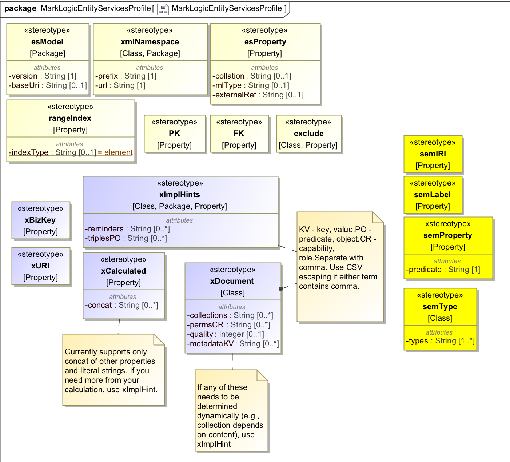

# The MarkLogic Entity Services Profile For UML

## Intro
The MarkLogic Entity Services profile contains stereotypes that you apply to your UML model to affect how this toolkit's transform maps your UML model to MarkLLogic Entity Services format. 

When defining your UML model in your UML tool of choice, import this profile into the tool to allow you to stereotype your model with ES-specific stereotypes. The [tutorials](../tutorials) show how to do this with [MagicDraw](../tutorials/magicdraw_model_edit.md) and [Papyrus](../tutorials/papyrus_model_edit.md).

Here is a visual representation of the profile:

## Reference
Stereotypes are organized into three sections: 
- **Core model**: These stereotypes (the pale yellow ones above) enhance your UML model with configuration to be included in the Entity Services model descriptor. An example is to designate an **elementRangeIndex** on a class attribute. If you include that stereotype in your UML model, the transform will include the range index in the Entity Services model descriptor. See [http://docs.marklogic.com/guide/entity-services/models] for a full reference to the descriptor.
- **Extended model**: These stereotypes (the blue ones above) enhance your UML model with configuration that **extends** the core model with **additional facts**. For example, the core model does not allow you to associate with a class a set of collections and permissions. But using the **xDocument** stereotype, you can make that association in the extended model. If you include that stereotype in your UML model, the transform will add a fact (expressed as a semantic triple) to the extended model indicating your collections and permissions. See [http://docs.marklogic.com/guide/entity-services/models#id_28304] for more on how facts can extend the model.
- **Semantics** - These stereotypes (the orange ones above) allow you to add semantic information to your model. Use this feature if you plan to use a multi-model database, consisting of not only documents but also semantic triples. The [HR example](../examples/hr) from this toolkit showcases this feature. In that example, we have Employee and Department documents, but we also use semantic triples to express organizational relationships, such as employee reporting structure and employee membership in departments. The toolkit's transform module generates XQuery or Javascript code that you can use at runtime, as you ingest your source date, to express those relationships as triples. For additional discussion of how the toolkit handles semantics, refer to [semantics.md](semantics.md). 

The following table describes each stereotype:

|Section|Level|Stereotype|Tag|"Musical" Type|Cardinality|Mapping To Entity Services|
|---|---|---|---|---|---|---|
|core|Model|esModel|version|string|1|Entity Services model version|
|core|Model|esModel|baseURI|string|0..1|Entity Services model base URI. If omitted, transform uses default.|
|core|Model|xmlNamespace|prefix|string|1|Entity Services XML namespace prefix for all entities|
|core|Model|xmlNamespace|url|string|1|Entity Services XML namespace URL for all entities|
|core|Class|xmlNamespace|prefix|string|1|Entity Services XML namespace prefix for that entity. Overrides model-level.|
|core|Class|xmlNamespace|url|string|1|Entity Services XML namespace URL for that entity. Overrides model-level.|
|core|Class|exclude||||Transform will not include entity corresponding to this class.|
|core|Attribute|PII||||Mark this attribute as personally identifiable information.|
|core|Attribute|exclude||||Transform will not include entity property corresponding to this attribute.|
|core|Attribute|PK||||The property corresponding to this attribute is the one and only primary key of the entity.|
|core|Attribute|FK||||The attribute refers to another class, but the corresponding property's type will be the corresponding entity's primary key type rather than an internal reference.|
|core|Attribute|elementRangeIndex||||The property corresponding to this attribute is added to the list of element range indexes for the entity.|
|core|Attribute|pathRangeIndex||||The property corresponding to this attribute is added to the list of path range indexes for the entity.|
|core|Attribute|wordLexicon||||The property corresponding to this attribute is added to the list of word lexicons for the entity.|
|core|Attribute|esProperty|mlType|string|0..1|The property corresponding to this attribute will have the specified type. This overrides the UML type.|
|core|Attribute|esProperty|externalRef|string|0..1|The property corresponding to this attribute will be an external reference with the specified value. Use the ES ref format.|
|core|Attribute|esProperty|collation|string|0..1|The string property corresponding to this attribute will have the specified collation.|
|extended|Model|xImplHints|reminders|string|0..*|This adds a reminder fact indicating that your model has the specified reminders. The reminder is the object of the semantic fact and is recorded in the fact as a string literal. The contents of the reminder can be just text (a "note to self") or can contain embedded code that you can evaluate at runtime. The contents are up to you.|
|extended|Model|xImplHints|triplesPO|CSV iri,istring|0..*|This adds a fact about your model. What is that fact? Well, you get to decide what the predicate and object are. You specify them in tags. You can specify multiple triplePO values; for each the transform creates a fact indicating that the model for the specified predicate has the specified object. In "triplePO", P means predicate, O means object. You specify PO as a CSV string. P is a fully-qualified or prefixed IRI known at design time. O can be either an IRI (fully-qualified or prefixed) or a string literal. If it is an IRI, it must be known at design time. If it is a string literal, it's like the reminder hint: it can be loose text or executable code.|
|extended|Class|xImplHints|reminders|string|0..*|This adds a reminder fact indicating that your class has the specified reminders. The reminder is the object of the semantic fact and is recorded in the fact as a string literal. The contents of the reminder can be just text (a "note to self") or can contain embedded code that you can evaluate at runtime. The contents are up to you.|
|extended|Class|xImplHints|triplesPO|CSV iri,istring|0..*|This adds a fact about your class. What is that fact? Well, you get to decide what the predicate and object are. You specify them in tags. You can specify multiple triplePO values; for each the transform creates a fact indicating that the class for the specified predicate has the specified object. In "triplePO", P means predicate, O means object. You specify PO as a CSV string. P is a fully-qualified or prefixed IRI known at design time. O can be either an IRI (fully-qualified or prefixed) or a string literal. If it is an IRI, it must be known at design time. If it is a string literal, it's like the reminder hint: it can be loose text or executable code.|
|extended|Class|xDocument|collections|xstring|0..*|This adds a fact indicating that the class contains the specified collections. The tag type is xstring, which means you specify the collections statically (as a fixed string) or dynamically (as the value of an attribute or even code). The transform's code generator uses this fact during generation of the writer module.|
|extended|Class|xDocument|permsCR|CSV string,string|0..*|This adds a fact indicating that the class contains the specified capability-role permissions. Currently these values must be fixed strings; they can't be dynamic.  The transform's code generator uses this fact during generation of the writer module.|
|extended|Class|xDocument|quality|int|0..1|This adds a fact indicating that the class has, for scoring purposes, the specified quality. Currently this value must be a static integer; it can't be dynamic. The transform's code generator uses this fact during generation of the writer module.|
|extended|Class|xDocument|metadataKV|string|0..*|This adds a fact indicating that the class contains the specified key-vlaue metadata pairs. Currently these values must be fixed strings; they can't be dynamic.  The transform's code generator uses this fact during generation of the writer module.|
|extended|Attribute|xImplHints|reminders|string|0..*|This adds a reminder fact indicating that your attribute has the specified reminders. The reminder is the object of the semantic fact and is recorded in the fact as a string literal. The contents of the reminder can be just text (a "note to self") or can contain embedded code that you can evaluate at runtime. The contents are up to you.|
|extended|Attribute|xImplHints|triplesPO|CSV iri,istring|0..*|This adds a fact about your attribute. What is that fact? Well, you get to decide what the predicate and object are. You specify them in tags. You can specify multiple triplePO values; for each the transform creates a fact indicating that the attribute for the specified predicate has the specified object. In "triplePO", P means predicate, O means object. You specify PO as a CSV string. P is a fully-qualified or prefixed IRI known at design time. O can be either an IRI (fully-qualified or prefixed) or a string literal. If it is an IRI, it must be known at design time. If it is a string literal, it's like the reminder hint: it can be loose text or executable code.|
|extended|Attribute|xCalculated|concat|xstring|0..*|This adds a fact indicating that the value of your attribute is the concatenation of the values indicated in the concat tag. Your attribute's type should be either string or IRI; if it is IRI, the concat should evaluate to a valid IRI. Each term in the concat can be either a static or dyanmic string.|
|extended|Attribute|xURI||||This adds a fact indicating that value of the attribute functions as the URI of an instance of the class. This stereotype has no tag. If you wish to specify how the URI is constructed, stereotype the same attribute as concat and build the URI that way. The transform's code generator uses this fact during generation of the writer module.|
|extended|Attribute|xBizKey||||This adds a fact indicating that the attribute is a business key of the class.|
|extended|Attribute|xHeader|field|xstring|1|This adds a fact indicating that this attribute should be added to the envelope header. The name of the header field is given by the tag "field", which can be a static name or dynamically evaluated. The value of the header field is the value of the attribute. The transform's code generator uses this fact during generation of the headers module.|
|semantic|Model|semPrefixes|prefixesPU|CSV string,string|1..*|Here you define prefixes of IRIs that you refer to in the other semantic stereotypes. In the tag prefixesPU, you write each prefix as a comma-separated string of prefix and URL. You can define multiple prefixes. You don't need to define common prefixes like owl, rdf, foaf; for a complete list of pre-defined prefixes, see <http://docs.marklogic.com/sem:prefixes>.|
|semantic|Class|semType|types|iri|1..*|Here you specify the RDF types that document instances of the class belong to. This stereotype is used by the tranform's code generator to build the triples section of the document envelope. For each type you specify in the types tag, the generator creates a triple SPO, where S is the semIRI of the instance, P is the rdf:type predicate, and O is the specified semantic type. You can specify the as fully-qualified or prefixed.|
|semantic|Class|semFacts|facts_sPO|CSV xiany?,xiany,xiany|1..*|This experimental stereotype allows you to build arbitrary triples for a document instance of your class. The transform's code generator adds these triples to the document envelope. You can add as many facts as you like. For each, the tag facts_sPO specifies the subject, predicate, and object of the triple. The subject is optional; if you omit it, the subject is the semIRI of the class. All values can be either static or dynamic. The [JokeBook example](../examples/jokeBook) shows the use of this stereotype.|
|semantic|Attribute|semIRI||||Here you specify the IRI of a document instance of this class. This attribute can have either a string or an IRI type. The IRI is the value of this attribute.  Typically the IRI is dynamic, dependent on other attributes in the class. You can use the xCalculated stereotype to build the IRI dynamically. The transform's semantic code generator uses the semIRI value to build triples at runtime.|
|semantic|Attribute|semLabel||||Here you specify the English RDFS label of a document instance of this class. The label is the value of this attribute. This attribute's type should be string. If you need more flexibility in labelling (e.g, French RDFS label, SKOS labels), use semFacts.|
|semantic|Attribute|semProperty|predicate|iri|1|Here you specify a semantic property of the document instance of your class. The transform's code generator adds a triple, expressing this property, to the document envelope. The subject of the property is the semIRI of your document instance; you must designate one of the attributes as semIRI. As for the predicate of the property, you specify that in the predicate tag. The object of the property is the value of the attribute unless you define qualifiedObject_sPO. Assuming you don't define qualifiedObject_sPO, the value is either a literal or an IRI. It is an IRI if the attribute's type is IRI or if the attribute is a reference to another object; if it is a reference to another object, that object's class must have a semIRI.  If the attribute's type is string, boolean, real, or integer, the object of the triple is a literal of that type.|
|semantic|Attribute|semProperty|qualifiedObject_sPO|CSV xipany?,xipany,xpiany|0..*|If you define this tag, the object of the semantic property is a qualified object, or a set of triples that describes the complex structure of the object. Use this when your property needs a qualified relation pattern. The way it works is as follows: the transform's code generator assigns as the object of the property a blank node. In your tag, you specify one or more predicate/object combinations for that blank node. THe blank node itself is just a placeholder; what the stereotype is stating is that the document instance of the class has a property whose object is a thing that can be described with the specified predicates and objects. The tag is qualifiedObject_sPO. It is a CSV of predicate-object. You can also specified subject-object-predicate if your subject is something other than the blank node. The [JokeBook example](../examples/jokeBook) shows the use of this stereotype.|

## Musical Types
The stereotype tags follow the "musical" grammar. "Musical" stands for MarkLogic UML Stereotype Impl Concat language. Here are the types:

- string - An unquoted string literal whose value is fixed at design time. 
- int - An integer (unquoted)
- iri - An unquoted string designating a semantic IRI whose value is fixed at design time. You can write it in two forms: fully-qualified IRI (http://xmlns.com/foaf/0.1/Person) or prefixed IRI (foaf:Person). If your prefix is not well-known, you should declare it using the semPrefixes stereotype. For a list of well-known prefixes, refer to <http://docs.marklogic.com/sem.prefixes>.
- istring - An IRI or a string. If it is unquoted, it is considered an IRI and must follow the Musical iri type syntax. If it is quoted, it is considered a string; the transform will remove the outer quotes.
- xstring: A static or dynamic string. Accepted forms:
	- @attribute(A) - The value of attribute A from the same class.
	- @xqy(xquery code) - The value resulting from execution of the code.
	- @sjs(server-side javascript code) - The value resulting from execution of the code. 
	- any unquoted string - resulting in a string
	- any quoted string - resulting in a string with the outer quotes preserved
- xiany - A static or dynamic IRI, string, integer, or boolean. Accepted forms:
	- @attribute(A) - The value of attribute A from the same class.
	- @xqy(xquery code) - The value resulting from execution of the code.
	- @sjs(server-side javascript code) - The value resulting from execution of the code. 
	- @iri - The IRI of the instance
	- @iri(I) - A fixed IRI in fully-qualified or prefixed form
	- unquoted string that converts to an integer - integer
	- unquoted string that converts to a boolean - boolean
	- unquoted string that converts to a real - real
	- unquoted string in the form of a prefixed IRI - IRI
	- unquoted string that is NOT in the form of the above - will treat like an IRI
	- quoted string - string with outer quotes removed
- xipany - A static or dynamic IRI, string, integer, or boolean used for semantics involving relationships between classes. Accepted forms:
	- @sattribute(A) - The value of attribute A from the source class.
	- @tattribute(A) - The value of attribute A from the target class.
	- @xqy(xquery code) - The value resulting from execution of the code.
	- @sjs(server-side javascript code) - The value resulting from execution of the code. 
	- @iri - The IRI of the source instance
	- @iri(I) - A fixed IRI in fully-qualified or prefixed form
	- $value - The value of the relationship's attribute.
	- unquoted string that converts to an integer - integer
	- unquoted string that converts to a boolean - boolean
	- unquoted string that converts to a real - real
	- unquoted string in the form of a prefixed IRI - IRI
	- unquoted string that is NOT in the form of the above - will treat like an IRI
	- quoted string - string with outer quotes removed

For CSVs, use CSV escape rules if any term contains a comma.

IMPORTANT NOTE: $xqy() and $sjs() are NOT supported currently. This is future functionality.

## Static vs Dynamic Tags
The stereotype's tags allow

- Every tag in a core model stereotype must be static. This content must be finalized at the time of generating the ES model.
- In the extended model stereotypes, every PREDICATE must be static. The content must be finalized at the time of generated the extended ES facts.
- In the extended model stereotypes, an OBJECT can be dynamic unless it's an IRI. If it's an IRI, the tranform must resolve the IRI prior to generating the extended fact. 
- In the semantic stereotypes, semTypes and semProperty.predicate are static. If you need dynamic types and properties, use semFacts instead.
- In the semantic stereotypes, the semIRI and semLabel are dynamic.

## Inheritance of Stereotypes
One issue in which we need to clearly set the rules is the inheritance of stereotypes from a superclass to a subclass. If class B refers to class A using a generalization relationship, B inherits the attributes of A. But does B also inherit the stereotypes of those attributes? And what of the class-level stereotypes? Does B inherit the class-level stereotypes of A?

Let's start with attributes. If superclass A defines attribute X, subclass B inherits attribute X with all of its stereotypes. If B does an OVERRIDE and specifies X as one of its attributes, B uses its own definition of X; B's attribute X does NOT inherit the stereotypes of A's attribute X. 

This can have significant consequences. For example, if X is stereotyped as PK in A but not in B, then X is NOT the primary key of B. Overriding the attribute has removed the primary key from B. If B wants a primary key, it needs to stereotype some other attribute as PK.  

On the other hand, suppose B leaves attribute X alone, inheriting it from A without overriding it. If B then adds a new attribute Y, which is not present in A, and stereotypes Y as PK, then B has TWO primary keys: X and Y. This is a problem; at most one primary key is permitted in a class.

Worse, suppose A has class-level stereotype semTypes and its attribute Z is stereotyped semIRI. Suppose B overrides attribute Z and, as a result, NONE OF ITS attributes is stereotyped as semIRI. This leads to a problem. B inherits the semantic types of A but has no IRI field; there is no way to specify triples indicating that instances of B have the RDF types specified by semTypes. 

Overriding inherited stereotyped attributes requires care. You usually DON'T NEED TO DO IT. When you do, don't shoot yourself in the foot.

As for class-level stereotypes, B inherits most, but not all, stereotypes from A. When B applies to itself a stereotype it inherits from A, in some cases the effect is to ADD to A's defintiion. In others the effect is to OVERRIDE/REPLACE A's definition.

The following table summarizes how the transform resolves class stereotype inheritance.

|Section|Stereotype|Inheritance Behavior|Who's Watching|
|---|---|---|---|
|core|xmlNamespace|Inherited but subclass can override it by defining the same stereotype.|UML-to-ES generator|
|core|exclude|Not inherited. The superclass is excluded, but subclasses are by default included. The [movies example](../examples/movies) shows the utility of using the superclass merely to define common attributes. In that example the superclass, Contributor, is excluded from the ES model. Its subclasses -- PersonContributor and CompanyContributor -- are included and inherit the attributes of Contributor.|UML-to-ES generator|
|extended|xImplHints|Not inherited. Hints are part of the extended model and used only in comment blocks and by code generators. Whoever's watching can apply the hints to subclasses if it deems appropriate.|Your code/code generator.|
|extended|xDocument|Inherited. If subclass also defines this stereotype it is ADDING. To have the subclass REPLACE/OVERRIDE rather than ADD, it should drop a hint.|DHF code generator. Your code generator or code.|
|sem|semTypes|Inherited. If subclass also defines this stereotype it is ADDING. To have the subclass REPLACE/OVERRIDE rather than ADD, it should drop a hint.|DHF code generator. Your code generator or code.|
|sem|semFacts|Inherited. If the subclass also defines this stereotype, it is ADDING.|DHF code generator. Your code generator or code.|
