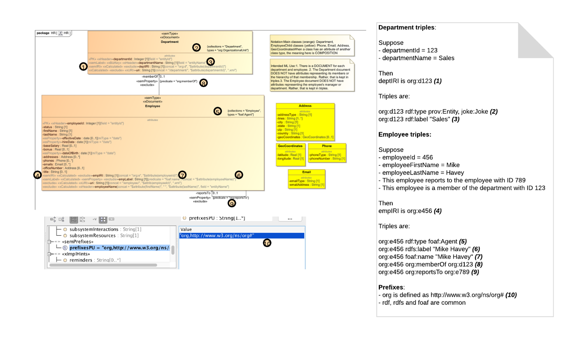
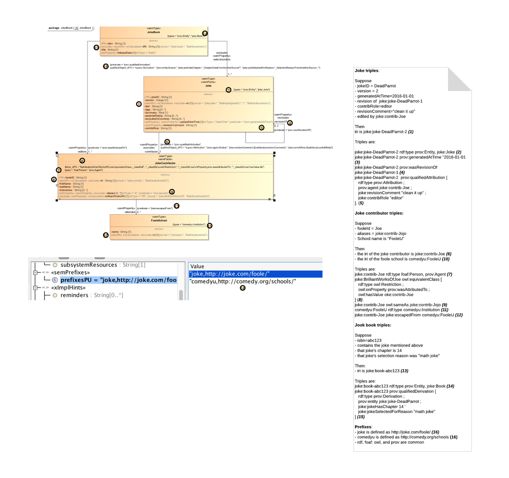

# Semantics and Mixed Modeling in the UML-to-Entity Services Toolit

Among the capabilities of the toolkit is the ability to model semantics. Specificially, the toolkit supports a mixed modelling approach in which documents contain embedded semantic triples. Those triples constitute semantic facts about the document, such as the document's provenance and its relationship to other semantic things. 

The toolkit is NOT meant to design semantic ontologies. Indeed, UML isn't a suitable notation for ontological design. There are several patterns in OWL that cannot easily be expressed in UML's class notation. (For example: an individual can belong to multiple classes; a property can have multiple domains; a property can have no domain; a class can be defined as the intersection of two other classes.) If you need to build an ontology, use an ontology tool, such as Protege or TopBraid Composer. 

The toolkit allows you associate semantic facts with your class definition. You model these facts using stereotypes. Your facts can reference ontologies. In the examples described below, UML classes reference provenance and organizational ontologies. 

## The Semantic Stereotypes
The stereotypes in our toolkit's UML profile for MarkLogic Entity Services are documented here: [profile.md](profile.md). In the profile there is a set of stereotypes to help you model the semantic part of your mixed model. Your model describes the structure of a *document* that is encased in an *envelope*. That envelope includes an important section called *triples*, where the semantic aspects of the document is contained. Semantics of a document include facts, expressed as triples, relating the document to other documents. 

You don't have to write the triples section of the envelope by hand. Using semantic stereotypes, your model can describe not only document structure but semantic meaning. The model can state that the document can be identified semantically with an IRI, that the document belongs to specific semantic classes, and the the document's relationships can be described using semantic properties. 

Here is a breakdown of the stereotypes:
- semType: The document belongs to (i.e., has as its RDF type) the specified semantic classes. [Something to ponder: The stereotype is tied to the UML class; a document whose structure is based on the UML class also has triples that tie it to semantic classes. This doesn't imply that the UML class has any connection to the semantic classes. It doesn't imply that the UML class is meant to define a semantic class.]
- semIRI: One of the attributes in the UML class contains the IRI of the document instance. 
- semLabel: One of the attributes in the UML class contains the RDFS English label of the document instance.
- semPredicate: A specific attribute in the UML class expresses a semantic property. That property's subject is the IRI of the document instance; put simply, the property is *about* the document instance containing this attribute. The object of the property is the attribute's value. That value might be simple: a literal, or the IRI of another document. But in the more interesting case, the value is a qualfied predicate, which itself is described through a series of triples; for more, see the JokeBook example below.
- semFacts: This is an arbitrary set of triples specifying any semantic facts you like about the document instance. The content of these triples can be dynamic, drawn from information available at runtime. See the JokeBook example below.
- semPrefixes: Prefixes for the IRIs you refer to in the above stereotypes. You don't need to specify prefixes for the common semantics sets like owl and rdf.

## Examples

### DHF Employee Sample
Here is the DHFEmployeeSample model and how triples are generated from it. To see a working sample, refer to [../examples/hr](../examples/hr).

### Joke Book
Here is the JokeBook model and how triples are generated from it. To see a working sample, refer to [../examples/jookBook](../examples/jokeBook).

Notice the following about this model:

- in (5), we specify qualified attribution. The joke is attributed to a joke contributor. In triple terms, the joke is the subject and the joke contributor the object. The predicate, though, is not simply that the object is attributed to the subject. The predicate itself is described semantically as having, for example, revision comments and the author's role.  
- in (7), we use semFacts create a new OWL class containing brilliant works of the specific contributor.
- in (15), we use non-qualified derivation. 

## For more..
- <http://developer.marklogic.com/blog/uml-modeling-marklogic-entity-services-semantics>

