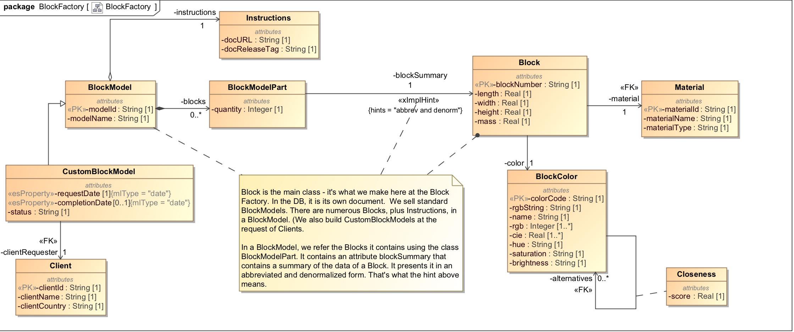

# Block Factory Example

## Intro
This sample demonstrates denormalization. In our block factory data model we see the common "BOM/part" No-SQL pattern. The block factory manufactures wooden and platic blocks of various colors and sizes. It also bundles blocks into "block models". An example of a block model is the Taj Mahal; the user of the model constructs a model of the Taj Mahal using the blocks provided. Think of the model as a bill of materials (BOM). The materials are the blocks. Conceptually the model "contains" blocks. From a design perspective, we have several ways to model that containment relationship:

- Have the model contain the full details of each block. We prefer not to do this because the block is a first-class entity, which ought to be modeled as its own document type.
- Have the model refer to its blocks by key. We prefer not to do this because then we need to join model to block every time we want
view the contents of the model. 
- Have the model contain an abbreviated and denormalized summary of each block. That's what we will do. There is lots of infomation to be gleaned about a block; the model includes just enough information to present an adequate bill of materials. If someone wants to know the full details of a block, he/she can obtain that block separately and inspect its structure.

Our model indicates, using a hint stereotype, that the relationship is abbreviated and denormalized. It does not describe exactly how this abbreviation and denormalization is represented; that's an implementation detail. 

## Models
Here is the MagicDraw model:

## The Cooking Show Approach

Like a cooking show, this example describes how to prepare the souffle but also gives a souffle already prepred for you to consume. 

The "prepared" souffle includes:
- The UML model.
- MLCP gradle tasks to ingest block source data and transform it to the form of the model
- ES instance converter already modified to address source-to-model mapping issues. Used in MLCP tasks.

If you were to start from scratch, you would follow this recipe:
- Devise the UML model in your favorite UML editor.
- Use the XMI to ES transformation to map the UML model to Entity Services. 
- From the Entity Services model, generate the instance converter.
- Tweak the instance converter to propertly map source fields to model fields. 
- In your gradle build file, add MLCP tasks to ingest data. 

## How to run:

Our project uses gradle. Before running, view the settings in gradle.properties. Create a file called gradle-local.properties and in this file override any of the properties from gradle.properties.

Here are the steps to setup.

### Setup DB
Setup new DB. Will use basic DB config with no indexes. Will bring in XMI2ES transform to our modules.

Run the following:

gradle -PenvironmentName=local -i clearGenerated includeXMI2ESTransform mlDeploy

Confirm:
- Content DB is empty
- Modules DB has these modules
  * /xmi2es/extender.xqy  - Common XMI-to-ES transform
  * /xmi2es/problemTracker.xqy - Common XMI-to-ES transform
  * /xmi2es/xmi2esTransform.xqy - Common XMI-to-ES transform
  * /ext/entity-services/BlockFactory-0.0.1.xqy - ES converter module
  * /xmi2es/loadBlockFactoryTransformation.xqy - MLCP transform: on ingest of block source data invokes ES converter module

### Transform UML to ES
Next, move our UML model into ML as an ES model. Let's divide this into two parts.

#### Load UML Model and Observe Output of Transform

We will load our UML model and transform it to Entity Services format. Run the following:

gradle -PenvironmentName=local -i ingestModel

Confirm:
- Final DB has the following documents
  * /xmi2es/es/BlockFactory.json (The ES model descriptor in JSON form)
  * /xmi2es/extension/BlockFactory.ttl (Semantic triples that extend our model)
  * /xmi2es/extension/BlockFactory.txt (A text summary of our model extension)
  * /xmi2es/findings/BlockFactory.xml (Problems found during transformation)
  * /xmi2es/xmi/BlockFactory.xml (The original UML model as an XMI document)
- Your gradle directory structure under data/entity-services-dump has the same documents as above.
- File BlockFactory.json exists in gradle's data/entity-services directory. This is our ES model descriptor to be deployed.
- File BlockFactory.ttl exists in gradle's data/entity-services-extension directory. This is our ES model extension to be deployed.

Notice we made use of the extended model definition. Specifically, we pasted the contents of /xmi2es/extension/BlockFactory.txt as a block comment into our conversion module plugins/ext/entity-services/BlockFactory-0.0.1.xqy. We refer back to that comment in several points in the code, showing that our implementation references facts from the extended model.

#### Deploy Entity Services Model and Associated Artifacts

Next, generate ES artifacts. Run the following:

gradle -PenvironmentName=local -i mlgen loadExtendedModel

Confirm:
- Final DB now has the following document
  * /marklogic.com/entity-services/models/BlockFactory.json

- In Query Console, open a tab of type SPARQL, point to the FINAL DB, run the following query, and verify you get any results. This means the ES model is in FINAL and its semantic metadata is populated.

select * where {?s ?o ?p}

Among the results, you should see the following:
- http://com.marlogic.es.umldemo.blockfactory/BlockFactory-0.0.1/BlockModelPart/blockSummary> <http://www.w3.org/1999/02/22-rdf-syntax-ns#type> <http://marklogic.com/entity-services#Property> - From basic ES model
- <http://com.marlogic.es.umldemo.blockfactory/BlockFactory-0.0.1/BlockModelPart/blockSummary>  <http://marklogic.com/xmi2es/xes/reminder>  "abbrev and denorm>" - From the extended ES model

- In gradle project, check for these newly generated files:
  * src/main/ml-modules/ext/entity-services/BlockFactory-0.0.1-GENERATED.xqy

We won't use any of these artifacts in this demo. The code already contains a tweaked version of BlockFactory-0.0.1.xqy in /plugins/ext/entity-services. Because we won't use these artifacts, we don't need to reload our schemas or modules.

### Ingest
Ingest block factory data based on the model

Run the following:

gradle -PenvironmentName=local -i ingestBlockData

Confirm:
- Content DB now has numerous block factory documents. 
  * block - 1000 
  * color - 358 
  * model - 2 
  * client - 1 
  * custom - 1 
  * material - 4

Here is some Javascript to get these counts:

var directories = ["block", "color", "model", "client", "custom", "material"];
var counts = [];
for (var i = 0; i < directories.length; i++) {
  counts.push(directories[i]);
  counts.push(cts.estimate(cts.directoryQuery("/xmi2es/blockFactory/" + directories[i] + "/")));
}
counts

## Explore Data
In Query Console, import XMI2ESBlockFactory.xml workspace. In each tab, try the query to explore an aspect of the data.

