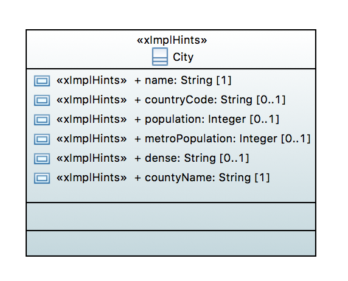
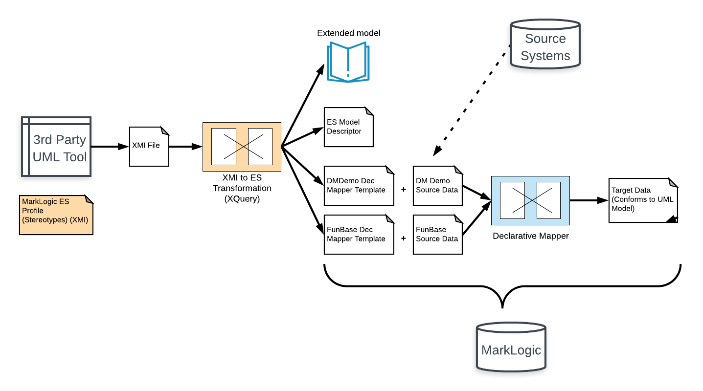

# A City Data Model With "Declarative Mapper" Source Mapping

## Intro
This example shows the interop of two tools: our UML-to-Entity Services toolkit; and the Declarative Mapper (TBD - link). The Declarative Mapper tool allows us to map data from source to target document using a configurable template. We map source to target without writing code. Rather, we compose a template, which is an XML or JSON document that specifies mapping expressions to transform source to target. At runtime, we apply the template to each source document; the Declarative Mapper outputs the desired target document.

Using Declarative Mapper as a standlone tool, we would write the template by hand. In this example, we generate it from a UML model. Our UML model defines the target structure of a city. Within the model, we use stereotypes from our ML profile to configure Declarative Mapper transformation expressions for each attribute. 

Here is our UML model. 

Notice we have a class, called City, consisting of several attributes: name, countryCode, population, metroPopulation, dense, and countryName. City is our target structure. We want the output of Declarative Mapper to bear the structure of City. The source data -- the input of Declarative Mapper -- has a much different structure. We don't model in UML the structure of the source. Rather, in the UML model, for each attribute, we stereotype the attribute as xImpl and tag the stereotype with a mapping expression. The stereotype indicates how we obtain the value of that attribute from source data. In effect, the UML model defines the target structure and reveals how to arrive at that structure from source data. 

In our example we have two sources of data: dmdemo and funbase. Each source has its own structure, and thus each needs its own mapping. 

dmdemo is a large JSON file, population.json, that contains hundreds of city records. Here is an excerpt:

	{
        "name": "BEIJING",
        "country": "CN",
        "population": "18590",
        "metro-population": "24900",
        "language": "zh-CN"
    },
    {
        "name": "Karachi",
        "country": "PK",
        "population": "18000",
        "metro-population": "27506",
        "language": "es"
    }

In funbase, cities are defined in a CSV. Here is an excerpt:

	city_name,country
	Otter Lake,USA
	US Flag,Moon
	Venustown,Mars

For a given attribute, the xImpl stereotype's tagged value defines how to map that attribute from source. Here is the mapping for countryName:

	* http://marklogic.com/xmi2es/xes/mapper/dmdemo,"""[[lookup('/countries.json', extract('country'), coalesce(@language, 'en'))]]"""
	* http://marklogic.com/xmi2es/xes/mapper/funbase,"""[[extract('country')]]"""

The first of these is the dmdemo mapping; to obtain countryName, we lookup in another document (countries.json), the English text name for the country whose code country source attribute. The second is the funbase mapping; from funbase the country attribute maps to the target countryName attribute.

When we put these transformations together -- you'll see this later when you open the Query Console workspace and work through the exercise -- we have enough detail to fully define Declarative Mapper templates for each source. Here is the template to produce a City document from dmdemo source. 

	<config xmlns="http://marklogic.com/declarative-mapper">
		<format>XML</format>
		<template>
			<City xmlns="http://org.jude/ml/uml2es/declarativeMapper/city">
				<name xmlns="">[[extract('name')]]</name>
				<countryCode xmlns="">[[extract('country')]]</countryCode>
				<countryName xmlns="">[[lookup('/countries.json', extract('country'), coalesce(@language, 'en'))]]</countryName>
				<population xmlns="">[[extract('population') * 1000 ]]</population>
				<metroPopulation xmlns="">[[extract('metroPopulation') * 1000 ]]</metroPopulation>
				<dense xmlns="">[[if((@'population' / @'metro-population') > 0.75, 'dense', 'sparse')]]</dense>
			</City>
		</template>
	</config>

Here is the template to produce a City document from funbase source:

	<config xmlns="http://marklogic.com/declarative-mapper">
		<format>XML</format>
		<template>
		<City xmlns="http://org.jude/ml/uml2es/declarativeMapper/city">
			<name xmlns="">[[extract('city_name')]]</name>
			<countryName xmlns="">[[extract('country')]]</countryName>
		</City>
		</template>
	</config>

The following figure shows the end-to-end flow. We define our model in our favorite toolkit-compliant UML tool. From that tool we export is as XMI and pass it though our UML-to-Entity Services toolkit. From the resulting Entity Services model (both the base model and its extensions), we generate the Declarative Mapper templates for each source. We produce target documents by applying these templates to the source documents. Significantly, the target documents have the form of our UML model. And we didn't have to write the templates by hand; our UML model defines them!

A few design points to mention:
- For many data models, we avoid source mapping altogether. The model shows the target we wish to build. There might be many sources from which the target obtains its data. The source structure is possibly very messy. The logic to transform source to target might be better expressed using a transform language than as stereotypes in the model. Even when the mapping is straightforward, we might consider the data model the wrong place to indicate source mapping logic. 
- We use the generic xImpl stereotype to specify source mapping. This stereotype can be used to specify any sort of design advice. We might have created a specific stereotype for source mapping. We haven't gone down that path because source mapping isn't often included in the data model artifact. See previous point.
- xImpl allows us to specify design advice as semantic triples. These triples are added to the extended Entity Services model. In the section "Explore the Mapping" you will see how we generate Declarative Mapper templates from these triples. Notice that we provide only the predicate and object. The predicate indicates which mapping to use -- in our example it's either dmdemo or funbase. The object is the Declarative Mapper expression. (As for the subject, it is the Entity Services IRI for the attribute.) In effect the triple says: for this attribute, from the source of type dmdemo (or funbase), use the following Declarative Mapper expression to obtain the value of the attribute.

## How to run:

Our project uses gradle. Before running, view the settings in gradle.properties. Create a file called gradle-local.properties and in this file override any of the properties from gradle.properties.

Here are the steps to setup.

### Setup DB
Setup new DB. Will use basic DB config with no indexes. Will bring in XMI2ES transform to our modules.

Run the following:

gradle -PenvironmentName=local -i includeXMI2ESTransform mlDeploy

Confirm:
- New DB and app server created with name xmi2es-examples-dmcity.

### Import the Model

Run the following to load the model:

gradle -PenvironmentName=local -i loadXMI

Confirm:
- Content DB includes several documents created when loading the XMI, including:
	* /xmi2es/es/DeclarativeCity.json - the ES model
	* /xmi2es/extension/DeclarativeCity.ttl - the extended ES model
	* /xmi2es/findings/DeclarativeCity.xml - findings during the transform
	* /xmi2es/xmi/DeclarativeCity.xml - the original Papyrus model (XMI)

Check the /xmi2es/findings/DeclarativeCity.xml file. This indicates whether there were any issues during the transform. Verify there are none.

### Load the Source Data

Load the source data into our content database:

gradle -PenvironmentName=local -i loadSources

Confirm:
- Content DB now has, in addition to the documents created in the previous step, the following documents

	* /population.json - A large JSON containing the source city data for the dmdemo data set
	* /countries.json - A JSON lookup file that maps country code to country name. Used during our Declarative Mapper transformation.
	* /Otter Lake.json - A city record from the funbase data set.
	* /US Flag.json - A city record from the funbase data set.
	* /Venustown.json - A city record from the funbase data set.

### Deploy Declarative Mapper

Obtain the Declarative Mapper tool and deploy to the modules database from this example: xmi2es-examples-dmcity-modules. (If you deploy it to a different modules database in the instance, following the instructions in the workspace to point to that modules DB.)

## Explore the Mapping
In Query Console, import XMI2ESDeclarative.xml workspace. You won't want to miss this part; it's where the fun happens. In this workspace you will: 
- Examine the source data and the entity services model.
- Generate the Declarative Mapper templates
- Pass the source data through the Declarative Mapper templates to obtain target data that conforms to the Entity Services model.
