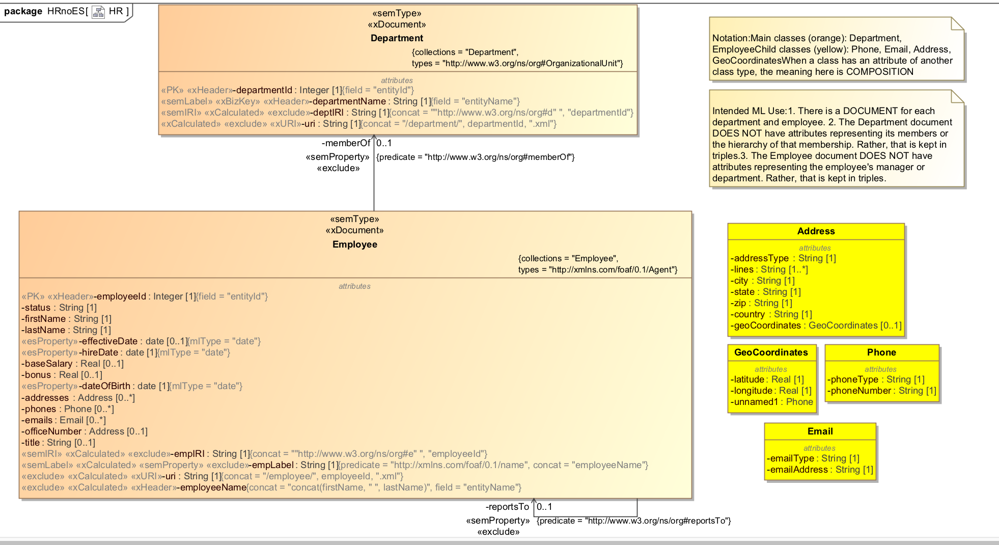

# Human Resources Non-Entity-Services Example

## Intro

This example is an expansion of the [main HR example] (../hr/README.md). Take a look at that example before proceeding with this example. 

Like the main HR example, this example demonstrates semantics and the Data Hub Framework. The main difference is how the harmonization code works. In the main example, we map the UML model to an Entity Services model. We use that Entity Services model to generate an instance converter, which maps source data to an XML form that conforms to the model. In short, we harmonize using Entity Services. 

In this example, we show how to map our UML model to harmonized HR entities without using Entity Services. We don't deploy an Entity Services model at all. We don't generate an instance converter. Rather, from the UML model we generate DHF harmonization modules that create the content, headers, and triples that make up these entities. There is no Entity Services in the middle!! Well, almost none... We don't reinvent the wheel; to generate the code, we leverage the UML-to-ES mapping provided by our transform. We piggy-back on our ES-influenced transform to generate decidedly non-ES code. 

For more on MarkLogic's Data Hub Framework (aka DHF), visit its GitHub page: <https://github.com/marklogic-community/marklogic-data-hub>.

Our source data comes from one of the DHF examples. <https://github.com/marklogic-community/marklogic-data-hub/tree/master/examples/hr-hub>

We use the following ontology: <https://www.w3.org/TR/vocab-org/>

## Model
Here is the our UML model:

## How We Use Data Hub

Refer to this same section in the [main HR example] (../hr/README.md).

## The Cooking Show Approach

Like a cooking show, this example describes how to prepare the souffle but also gives a souffle already prepred for you to consume. 

The "prepared" souffle includes:
- The UML model.
- MLCP gradle tasks to ingest the data to STAGING
- Harmonization plugins to harmonize the data to FINAL.

If you were to start from scratch, you would follow this recipe:
- Devise the UML model in your favorite UML editor.
- Using the XMI to ES transformation as the starting point, generate the harmonization plugins 
- In your gradle build file, add MLCP tasks to ingest department and employee data. 

## How to run:

Our project uses gradle. Before running, view the settings in gradle.properties. Create a file called gradle-local.properties and in this file override any of the properties from gradle.properties.

Here are the steps to setup.

### Setup New DB
We will begin with basic DB config with no indexes. Will bring in the XMI2ES transform to our modules DB.

Run the following:

gradle -PenvironmentName=local -i clearGenerated includeXMI2ESTransform mlDeploy

Confirm:
- Modules DB has these modules
  * /xmi2es/extender.xqy - Common XMI-to-ES transform
  * /xmi2es/problemTracker.xqy - Common XMI-to-ES transform
  * /xmi2es/xmi2esTransform.xqy - Common XMI-to-ES transform
  * /ext/demo/dhfGenerator.xqy - Demo-grade reusable UML to DHF generator. 
  * /ext/hr/gen/dhfLib.xqy - Generated DHF functions to be used in DHF modules. THIS IS THE GENERATED CODE! We pre-cooked it.
  * /entities/Employee* - DHF Employee input and harmonization flows. These CALL dhfLib.xqy.
  * /entities/Department* - DHF Department input and harmonization flows. These CALL dhfLib.xqy.
- Staging, Final, Schemas databases are empty
- No documents having URI containing GENERATED in modules, FINAL, STAGING, or schemas DB.

### From UML Model Generate Harmonization

gradle -PenvironmentName=local -i generateHarmonization

Confirm:
- Final DB has several documents with "/xmi2es/" URI. These were produced by the transform and code generated. They are no longer needed. Ignore them.
- The file plugins/ext/hr/gen/dhfLib.xqy has been updated. Although we pre-cooked it, we just re-generated it.

### Ingest
Ingest staging data and some triples for FINAL	

Run the following:

gradle -PenvironmentName=local -i loadSummaryOrgTriples runInputMLCP

Confirm:
- In STAGING we now have 2008 documents. Of these:
  * 1002 are in Employees collection
  * 1000 are in Salary collection
  * 5 are in Department collection

- In FINAL we have the a document containing triples in the collection http://www.w3.org/ns/org.

### Harmonize
Run harmonization to move employee and department data to FINAL.

Run the following:

gradle -PenvironmentName=local -i hubRunFlow -PentityName=Department -PflowName=HarmonizeDepartment

gradle -PenvironmentName=local -i hubRunFlow -PentityName=Employee -PflowName=HarmonizeEmployee

Confirm:
FINAL now contains numerous documents including
  - 5 in Department collection
  - 1002 in Employee collection

## Explore the Data
In Query Console, import the workspace XMI2ESHR.xml. In each tab, try the query to explore an aspect of the data.
