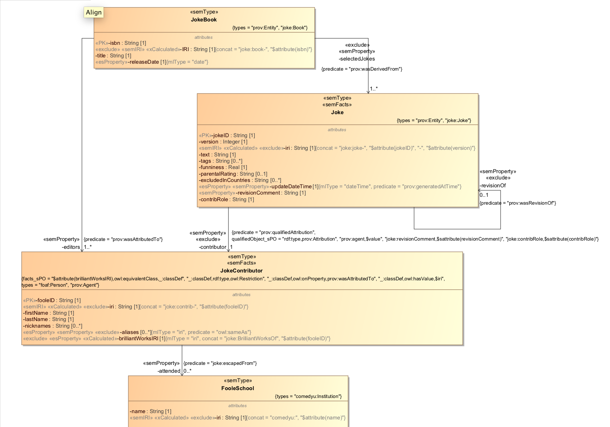

# JokeBook - Advanced Semantics

## Intro
This example exercises all the semantic stereotypes of the toolkit's profile. It shows how to tie a UML class to a semantic class, how to relate UML classes using semantic properties, how to qualify a semantic property with additional semantic facts, and how add associate arbitrary semantic facts with a UML class.

Here is our UML model. 

The toolkit's documentation shows how JokeBook's model maps to triples: [../../docs/semantics.md](../../docs/semantics.md).

Read about the semantic stereotypes here: [../../docs/profile.md](../../docs/profile.md).

## How to run:

Our project uses gradle. Before running, view the settings in gradle.properties. Create a file called gradle-local.properties and in this file override any of the properties from gradle.properties.

Here are the steps to setup.

### Setup DB
Setup new DB. Will use basic DB config with no indexes. Will bring in XMI2ES transform to our modules.

Run the following:

gradle -PenvironmentName=local -i includeXMI2ESTransform mlDeploy

Confirm:
- New DB and app server created with name xmi2es-examples-jokebook.

### Import the Model

Run the following to load the model:

gradle -PenvironmentName=local -i loadXMI

Confirm:
- Content DB includes several documents created when loading the XMI, including:
	* /xmi2es/es/JokeBook.json - the ES model
	* /xmi2es/extension/JokeBook.ttl - the extended ES model
	* /xmi2es/findings/JokeBook.xml - findings during the transform
	* /xmi2es/xmi/JokeBook.xml - the original MagicDraw model (XMI)
	* 

Check the /xmi2es/findings/DeclarativeCity.xml file. This indicates whether there were any issues during the transform. Verify there are none.

### Load the Source Data

Load the source data into our content database:

gradle -PenvironmentName=local -i loadSources

Confirm:
- Content DB now has, in addition to the documents created in the previous step, the following documents

	* /population.json - A large JSON containing the source city data for the dmdemo data set
	* /countries.json - A JSON lookup file that maps country code to country name. Used during our Declarative Mapper transformation.
	* /Otter Lake.json - A city record from the funbase data set.
	* /US Flag.json - A city record from the funbase data set.
	* /Venustown.json - A city record from the funbase data set.

### Deploy Declarative Mapper

Obtain the Declarative Mapper tool and deploy to the modules database from this example: xmi2es-examples-dmcity-modules. (If you deploy it to a different modules database in the instance, following the instructions in the workspace to point to that modules DB.)

## Explore the Mapping
In Query Console, import XMI2ESDeclarative.xml workspace. You won't want to miss this part; it's where the fun happens. In this workspace you will: 
- Examine the source data and the entity services model.
- Generate the Declarative Mapper templates
- Pass the source data through the Declarative Mapper templates to obtain target data that conforms to the Entity Services model.
