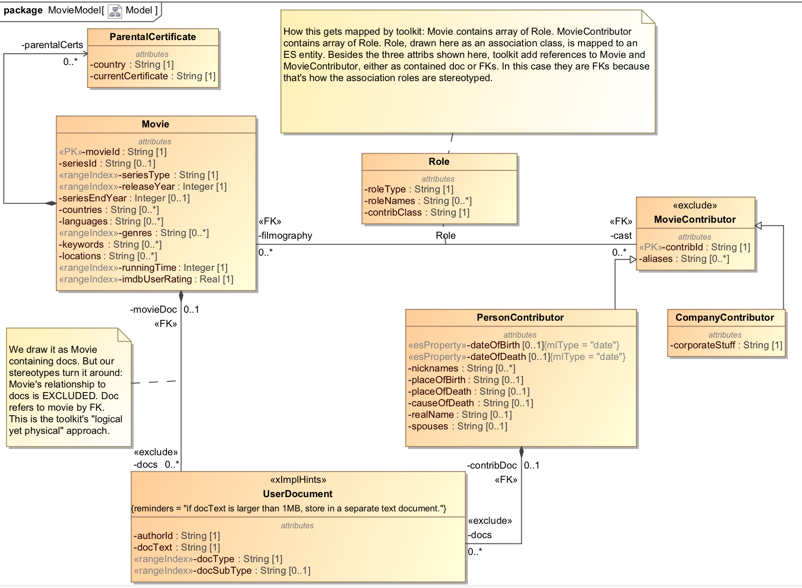

# Movie Example

## Intro
This movie data model examples shows how various types of UML class relationships are modeled in MarkLogic in an Entity Services model. It also explains shows how to use Template-Driven Extraction (TDE) to build SQL views of this data.

## Models
Here is the MagicDraw model:

## The Cooking Show Approach

Like a cooking show, this example describes how to prepare the souffle but also gives a souffle already prepred for you to consume. 

The "prepared" souffle includes:
- The UML model.
- MLCP gradle tasks to ingest the movie source data and transform it to the form of the model
- ES instance converter already modified to address source-to-model mapping issues. Used in MLCP tasks.
- TDE template already modified to present views using the relationships specified in the UML mode.

If you were to start from scratch, you would follow this recipe:
- Devise the UML model in your favorite UML editor.
- Use the XMI to ES transformation to map the UML model to Entity Services. 
- From the Entity Services model, generate the instance converter and TDE template.
- Tweak the instance converter to propertly map source fields to model fields. 
- Tweak the TDE template to adjust the views as needed.
- In your gradle build file, add MLCP tasks to ingest department and employee data. 

## How to run:

Our project uses gradle. Before running, view the settings in gradle.properties. Create a file called gradle-local.properties and in this file override any of the properties from gradle.properties.

Here are the steps to setup.

### Setup DB
Setup new DB. Will use basic DB config with no indexes. Will bring in XMI2ES transform to our modules.

Run the following:

gradle -PenvironmentName=local -i clearGenerated useInitialDBConfig includeXMI2ESTransform mlDeploy

Confirm:
- Content DB is empty and has no element range indexes
- Schemas DB contains:
  * /MovieModel-0.0.1.tdex - our "pre-cooked" TDE template
- Modules DB has these modules
  * /xmi2es/extender.xqy  - Common XMI-to-ES transform
  * /xmi2es/problemTracker.xqy - Common XMI-to-ES transform
  * /xmi2es/xmi2esTransform.xqy - Common XMI-to-ES transform
  * /ext/entity-services/MovieModel-0.0.1.xqy - ES converter module
  * /xmi2es/loadMovieTransformation.xqy - MLCP transform: on ingest of movie source data invokes ES converter module

### Transform UML to ES
Next, move our UML model into ML as an ES model. Let's divide this into two parts.

#### Load UML Model and Observe Output of Transform

We will load our UML model and transform it to Entity Services format. Run the following:

gradle -PenvironmentName=local -i ingestModel

Confirm:
- Final DB has the following documents
  * /xmi2es/es/IMDBMovie.json (The ES model descriptor in JSON form)
  * /xmi2es/extension/IMDBMovie.ttl (Semantic triples that extend our model)
  * /xmi2es/extension/IMDBMovie.txt (A text summary of our model extension)
  * /xmi2es/findings/IMDBMovie.xml (Problems found during transformation)
  * /xmi2es/xmi/IMDBMovie.xml (The original UML model as an XMI document)
- Your gradle directory structure under data/entity-services-dump has the same documents as above.
- File IMDBMovie.json exists in gradle's data/entity-services directory. This is our ES model descriptor to be deployed.
- File IMDBMovie.ttl exists in gradle's data/entity-services-extension directory. This is our ES model extension to be deployed.

Notice we made use of the extended model definition. Specifically, we pasted the contents of /xmi2es/extension/IMDBMovie.txt as a block comment into our conversion module plugins/ext/entity-services/IMDBMovie-0.0.1.xqy. We refer back to that comment in several points in the code, showing that our implementation references facts from the extended model.

#### Deploy Entity Services Model and Associated Artifacts

Next, generate ES artifacts. Run the following:

gradle -PenvironmentName=local -i mlgen loadExtendedModel

Confirm:
- Final DB now has the following document
  * /marklogic.com/entity-services/models/IMDBMovie.json

- In Query Console, open a tab of type SPARQL, point to the FINAL DB, run the following query, and verify you get any results. This means the ES model is in FINAL and its semantic metadata is populated.

select * where {?s ?o ?p}

Among the results, you should see the following:
- <http://com.marklogic.es.uml.movie/MovieModel-0.0.1/Movie/cast> <http://marklogic.com/entity-services#datatype> <http://marklogic.com/json#array> - From basic ES model
- <http://com.marklogic.es.uml.movie/MovieModel-0.0.1/Movie/cast> <http://marklogic.com/xmi2es/xes/relationship>  "association" - From the extended ES model

- In gradle project, check for these newly generated files:
  * src/main/ml-config/databases/content-database-GENERATED.json - Generated DB config with indexes specified in model. We will use this.
  * src/main/ml-modules/ext/entity-services/MovieModel-0.0.1-GENERATED.xqy - Generated instance converter. We don't need this because we have the pre-cooked one in the same directory. 
  * src/main/ml-modules/options/MovieModel.xml - Generated search options
  * src/main/ml-schemas/MovieModelPhysical-0.0.1.xsd - Generated XML schema. We won't use this.
  * src/main/ml-schemas/tde/MovieModel-0.0.1.tdex - Generated TDE template. We don't need this. The pre-cooked version is src/main/ml-schemas/MovieModel-0.0.1.tdex 

### Deploy
Deploy these artifacts: DB indexes, modules and schemas. IT IS VERY IMPORTANT TO DELETE THE GENERATED TDE TEMPLATE!!!

Run the following:

gradle -PenvironmentName=local -i useGeneratedDBConfig deleteGeneratedTDE mlDeployDatabases mlReloadModules mlReloadSchemas

Confirm:
- Content DB now has element range indexes
- Schemas DB has ONLY ONE tdex document: /MovieModel-0.0.1.tdex

### Ingest
Ingest movie data based on the model

Run the following:

gradle -PenvironmentName=local -i ingestMovieData

Confirm:
- Content DB now has the movie documents. Check the totals per collection. 
  - bio:2
  - company:1
  - movie:5
  - movieDoc:2
  - person:3

If your count is different, it might be because you have two TDE templates. Go back to step 3 and confirm the results.

## Explore Data
In Query Console, import XMI2SMovies.xml workspace. In each tab, try the query to explore an aspect of the data.

