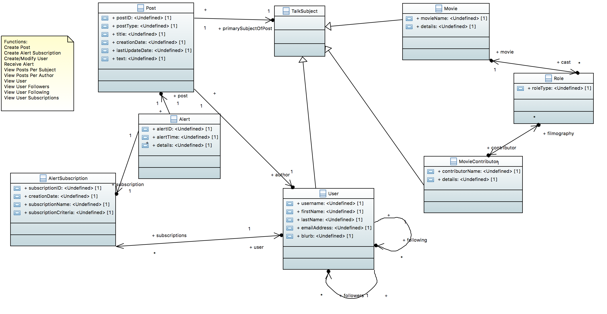

# MovieTalk Example

## Intro
MovieTalk is an application that allows users to submit posts about movies and actors. Our UML model is a logical data model that describes the main entities -- movies, contributors, users, posts, alerts -- and their relationships. The model is merely logical. When the application team implemented MovieTalk, they referred to the logical model but arranged the data in MarkLogic somewhat differently. There is therefore a gap between the logical model and its physical implementation. Suppose, for fun, that the application team has departed but the stakeholders wish to know what the physical model looks like and how it maps back to the logical model. We would prefer not to read the application code. In this example we use a data discovery approach to determine the mapping.

## Models
Here is the model, designed in Papyrus:

The Eclipse project for Papyrus is in data/MovieTalkPapyrus. If you would like to view/edit it in Eclipse, import both this project and the profile Eclipse project at [../umlProfile/eclipse/MLProfileProject](../../umlProfile/eclipse/MLProfileProject).

The Eclipse project is in data/DeclarativeCity. If you would like to view/edit it in Eclipse, import both this project and the profile Eclipse project at [../umlProfile/eclipse/MLProfileProject](../../umlProfile/eclipse/MLProfileProject).

## How to run:

Our project uses gradle. Before running, view the settings in gradle.properties. Create a file called gradle-local.properties and in this file override any of the properties from gradle.properties.

Here are the steps to setup.

### Setup DB
Setup new DB. Will use basic DB config with no indexes. Will bring in XMI2ES transform to our modules.

Run the following:

./gradlew -i setup mlDeploy

Confirm:
- New DB and app server created with name xmi2es-examples-movieTalk.

### Load the Logical Model

We want the logical model in MarkLogic as an Entity Services model. That might sound strange. It's a logical model; why deploy it? We will use it later for a novel purpose: to help build our physical-logical mapping. The logical model we designed in Papyrus lacks enough detail to be used physically anyway. Most of its attributes do not even have a data type. When we deploy the model to MarkLogic as an Entity Services, we will specify the "lax" option to our UML/ES transformation tool. The "lax" option instructs the transformation tool to tolerate the logical model's lack of detail and make a best effort to produce an Entity Services model.  
To deploy the logical model, run the following:

./gradlew -b uml2es.gradle -i -PmodelFile=../umlModels/MovieTalk.xml -Plax=true uDeployModel

Confirm:
- Content DB includes several documents created when loading the XMI, including:
	* /marklogic.com/entity-services/models/MovieTalk.json - the ES model
	* /xmi2es/extension/MovieTalk.ttl - the extended ES model
	* /xmi2es/findings/MovieTalk.xml - findings during the transform
	* /xmi2es/xmi/MovieTalk.xml - the original Papyrus model (XMI)

Check the /xmi2es/findings/MovieTalk.xml file. This indicates whether there were any issues during the transform. Verify there are none.

## Explore Logical vs. Physical
In Query Console, import XMI2ESMovieTalk.xml workspace. 

Your first step is to import the physical data. Go to the "Populate Physical Data" tab and run to load data. Don't cheat! Don't look at code that populates the data. Assume that code is missing and you want to discover the data's structure by querying it.

Next go to the tab "Discover" to discover the data.

The tab "Discover" is where we map physical back to logical. 

