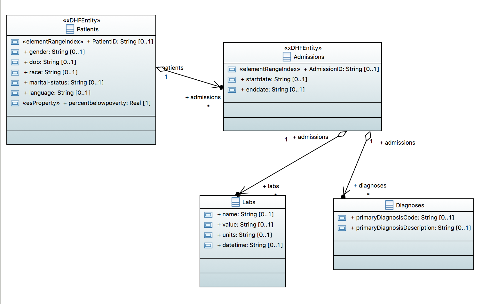

# Patient Hub: UML2ES in DHF 5

## Intro
This example piggybacks on an example included in Data Hub's GitHub repo: the Patient Hub. You can find that example here: <https://github.com/marklogic/marklogic-data-hub/tree/master/examples/patient-hub>. We enhance that example by modeling its entities -- Patient, Admission, Lab, Diagonis -- in UML. We then use UML2ES to convert the UML model to Entity Services. We need to end up with a set of entity definitions that closely resemble the ones provided in the example (in <https://github.com/marklogic/marklogic-data-hub/tree/master/examples/patient-hub/entities>). Once the entities are in place, the steps to run are just those of the example. 

For convenience, a copy of that example is provided here.

## Models
We use Papyrus to compose the UML model. The Eclipse project is in data/PatientHubUML. If you would like to view/edit it in Papyrus, import both this project and the profile Eclipse project at [../umlProfile/eclipse/MLProfileProject](../../umlProfile/eclipse/MLProfileProject). Here is what the model looks like:

## How to run:

Our project uses gradle. Before running, view the settings in gradle.properties. If you need to modify them, create a file called gradle-local.properties and in this file override any of the properties from gradle.properties. When calling gradle, use the -PenvironmentName=local option to use your local properties.

Here are the steps to setup.

### Setup DB
Setup a new hub that includes UML2ES: 

Run the following:

./gradlew -i hubInit setup mlDeploy

Confirm:
- In Admin UI, check for new databases and app servers with names starting with xmi2es-examples-patient-hub
- In Query Console, explore the xmi2es-examples-patient-hub-MODULES database. Confirm it has the docuemnt /xmi2es/xmi2esTransform.xqy.

### Transform UML to ES

Now we convert the patient UML model to Entity Services:

./gradlew -i -b uml2es4dhf5.gradle -PmodelName=PatientHubUML uDeployModel

Confirm:
- Content DB includes several documents created when loading the XMI files, including:
	* /marklogic.com/entity-services/models/RunningRace.json - ES model based on MagicDraw UML model
	* /marklogic.com/entity-services/models/RunningRaceEMF.json - ES model based on EMF UML model
	* /marklogic.com/entity-services/models/RunningRacePapyrus.json - ES model based on Papyrus UML model
	* /xmi2es/findings/RunningRace.xml - findings during the transform from MagicDraw to ES
	* /xmi2es/findings/RunningRaceEMF.xml - findings during the transform from EMF to ES
	* /xmi2es/findings/RunningRacePapyrus.xml - findings during the transform from Papyrus to ES

	TODO - fix this

Check each of the findings documents: /xmi2es/findings/RunningRace.xml, /xmi2es/findings/RunningRaceEMF.xml, /xmi2es/findings/RunningRacePapyrus.xml. Verify there are no issues reported in any of them.

## Create Hub Entities

./gradlew -b uml2es4dhf5.gradle -i uCreateDHFEntities -PmodelName=PatientHubUML -PentitySelect=all

TODO: confirm

## Run Example As Is

And now we run the original example and confirm that its flows function properly with our UML model. 

