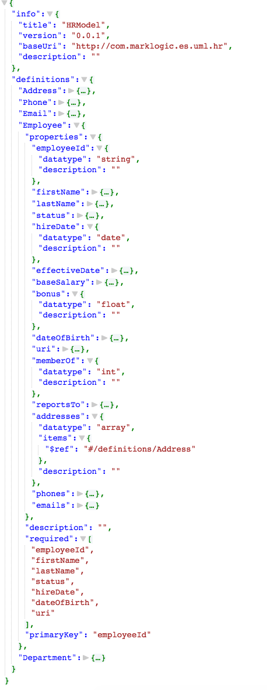
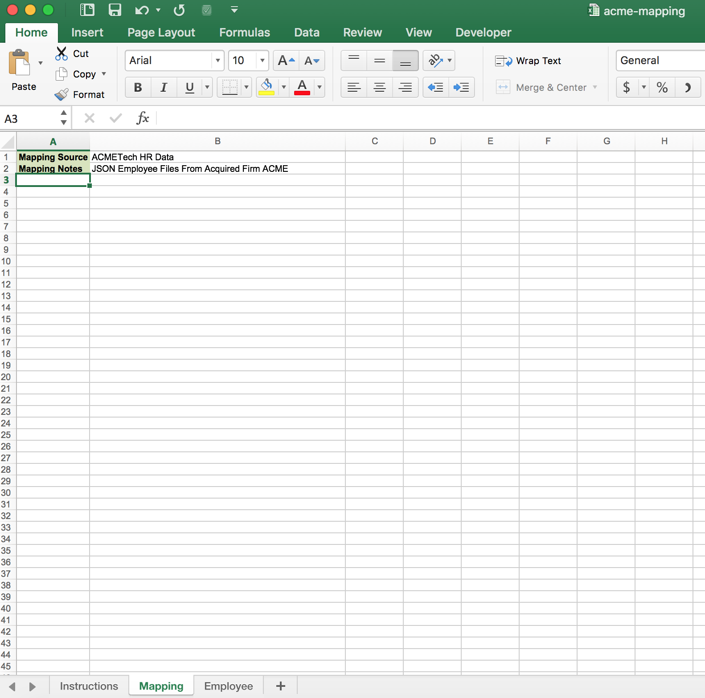
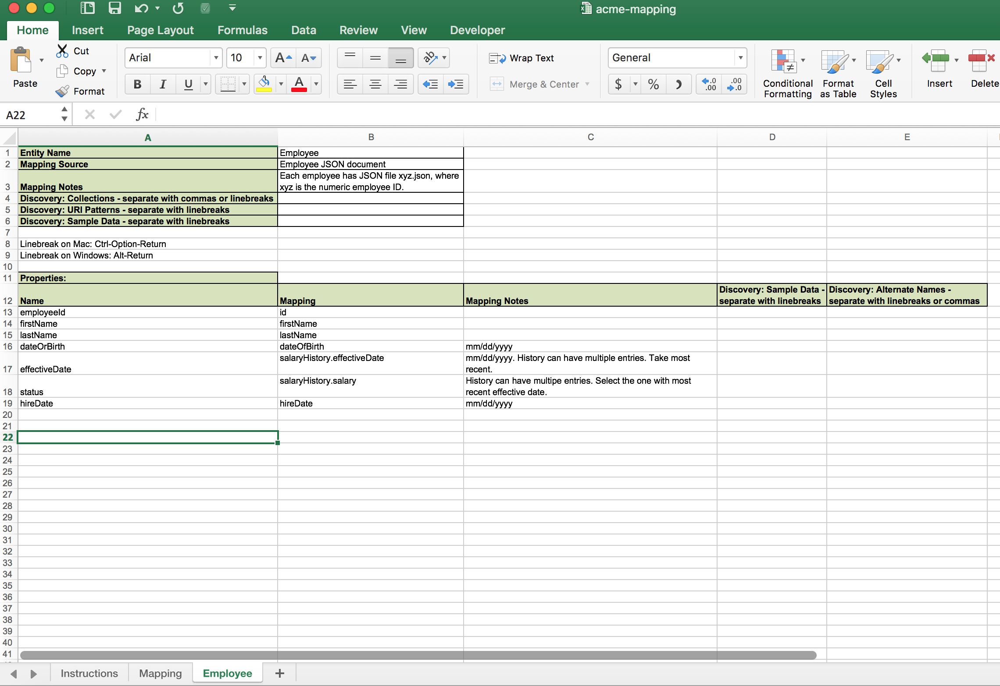
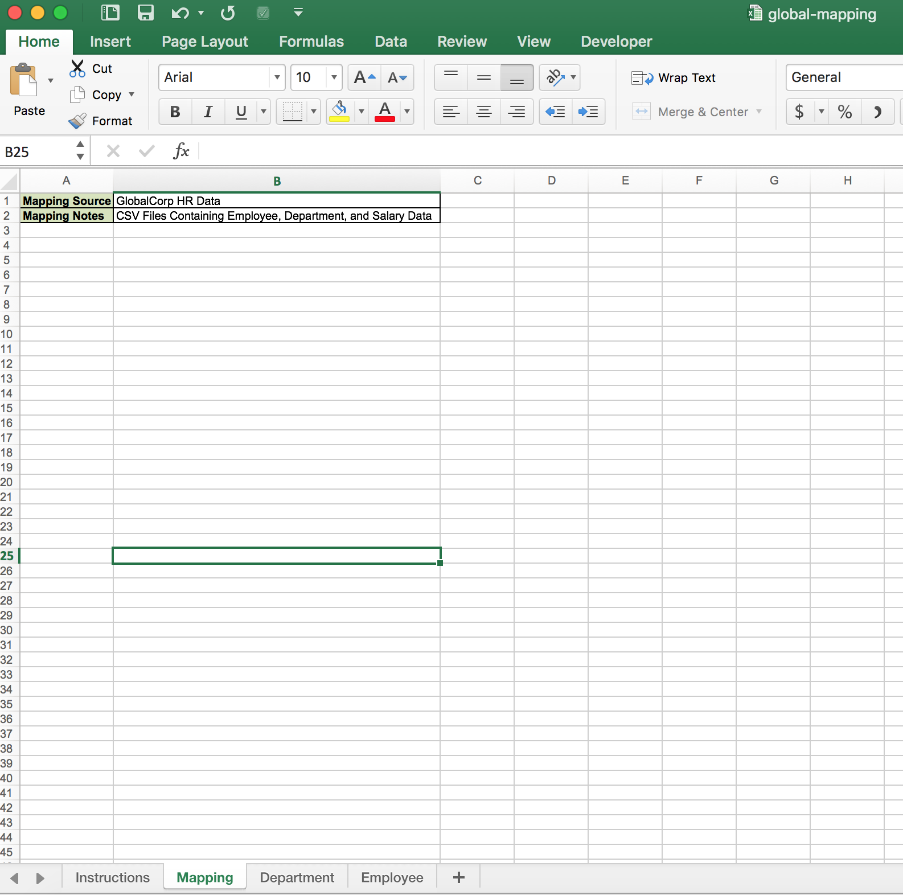
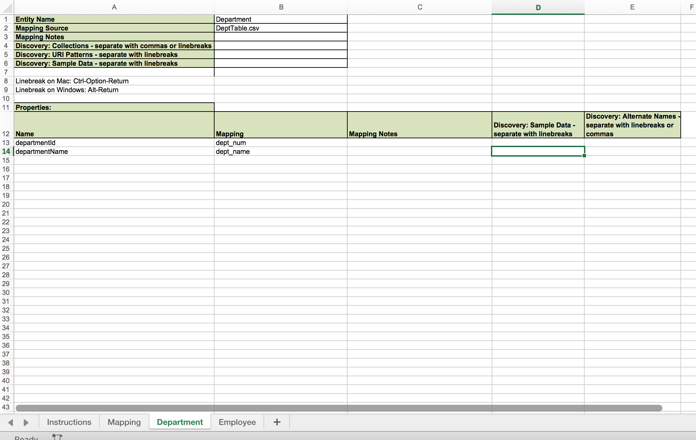
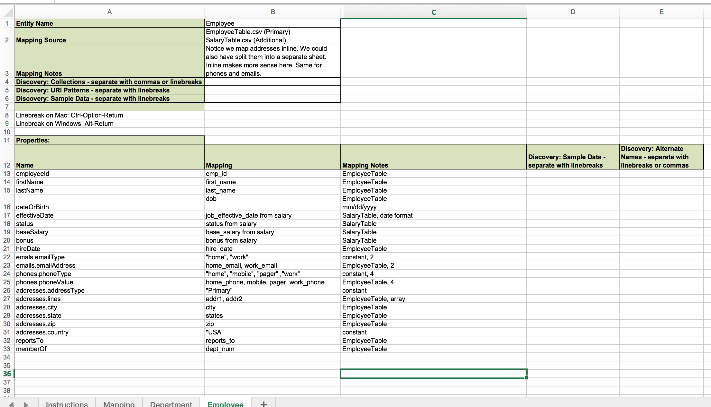
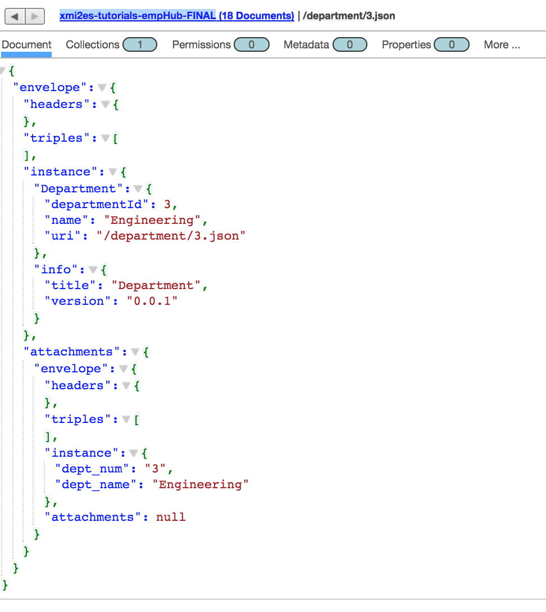
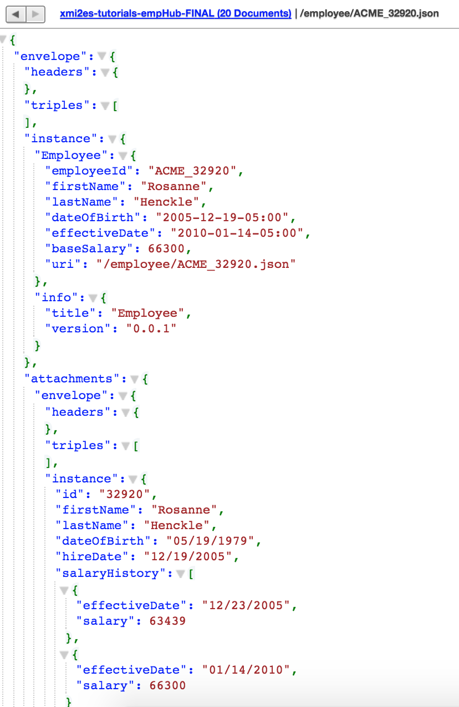
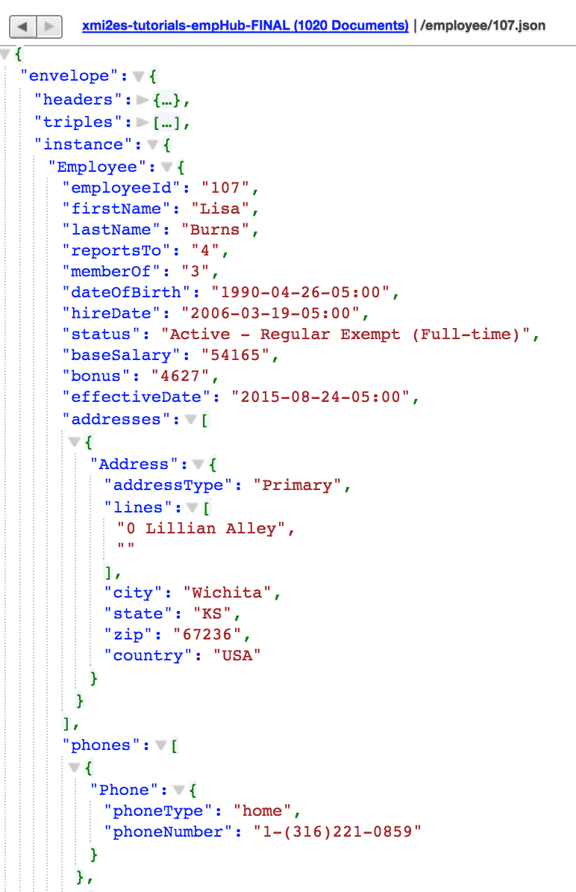

# Zero Code Model-Map-Harmonize (MarkLogic Internal)

## Intro
This tutorial shows how you, *without having to write any code*, can move raw, messy data into MarkLogic and convert it to a much better form that conforms to a UML model. Our approach can best be described as *model-driven declarative mapping*. There's no coding; developers aren't needed. Rather, the brunt of the work is done by the two roles you would expect: 

- A data architect, who creates the data model in a third-party UML tool (in our case, Papyrus).
- A source-data subject-matter expert (SME), who uses the Declarative Mapper UI tool to define the source-to-target mapping. This SME is an expert in the messy source data and works closely with the data architect to understand the UML-defined target data format.

The data architect and source-data SME are helped by a build person, who creates a gradle-based MarkLogic data hub environment that incorporates the UML and mapping tools. 

The diagram below outlines the steps of the zero-code effort


1. The data architect in Papyrus creates the UML data model. 

2. The data architect, using the build environment created by the build person, uses UML2ES to convert the UML model to MarkLogic's Entity Services (ES) form. 

3. The source-data SME works within the Declarative Mapper UI tool to map source data to the model form of the data. The model form is the Entity Services form produced in step 2.

4. The source-data SME works with the build person to incorporate the declarative mapping (produced in step 3) into the a data hub harmonization process. When this harmonization process is run, the raw source data is converted to the model's form using the declarative mapping.

There's no coding in this process... not even in step 4. All the work is done by data experts and tools! To see why, try out this tutorial! You will play each of the roles through all the above steps. 

For this tutorial you need MarkLogic (version 9 or later), UML2ES, Papyrus (an open-source UML tool), the Declarative Mapper UI (a MarkLogic field tool), and the Declarative Mapper engine (another MarkLogic field tool). [The two Declarative Mapper tools are available on MarkLogic's internal BitBucket repository. This tutorial is MarkLogic internal.]

- You will need a local clone of UML2ES
- See [How to install Papyrus](papyrus_install.md) for instructions on installing Papyrus
- See [How to install Declarative Mapper](dm_install.md) for instructions on installing the Declarative Mapper UI and engine

## Step 1: Standup a MarkLogic Environment and Build Process (Build Person)

<details><summary>Click to view/hide this section</summary>
<p>

We get started by having you, in the role of build person, setup a data hub, with UML2ES and the Declarative Mapper, on MarkLogic.

Pre-requisites:
- MarkLogic 9 (or greater) installation up and running
- Local clone of UML2ES
- Local clone of Declarative Mapper engine. See [How to install Declarative Mapper](dm_install.md)
- Declarative Mapper UI up and running. First obtain a local clone. Then setup and run. See [How to install Declarative Mapper](dm_install.md)

To begin, create a folder called dmHub anywhere on your build machine. This folder will be a data hub gradle project that incorporates the UML2ES and the DM toolkits.

Under dmHub, create the following subfolders:
- data
- src
- lib

Under dmHub/data, create the following subfolders:
- model
- papyrus

Under dmHub/src, create the subfolder main.

Under dmHub/src/main, create the subfolder ml-modules.

Under dmHub/src/main/ml-modules, create the subfolders root and ext

Copy into dmHub/src/main/ml-modules/root the UML2ES transform code [../uml2esTransform/src/main/ml-modules/root/xmi2es](../uml2esTransform/src/main/ml-modules/root/xmi2es). You did it right if you can see the file dmHub/src/main/ml-modules/root/xml2es/xml2esTransform.xqy. If you don't see the file in exactly that this location, remove what you copied and try again at the correct level. 

Copy into dmHub/src/main/ml-modules/ext the Declarative Mapper engine code. Copy from your local DM engine clone the directory declarative-mapper/src/main/ml-modules/root/ext to dmHub/src/main/ml-modules/root/ext. You did it right if you can see dmHub/src/main/ml-modules/ext/declarative-mapper.sjs and dmHub/src/main/ml-modules/ext/declarative-mapper/runtime.sjs. If you don't see the files in exactly that this location, remove what you copied and try again at the correct level. 

Copy into the main folder dmHub the UML2ES build file [../uml2esTransform/uml2es4dhf.gradle](../uml2esTransform/uml2es4dhf.gradle).

Copy into dmHub/data/papyrus the UML2ES profile [../umlProfile/eclipse/MLProfileProject](../umlProfile/eclipse/MLProfileProject). You did it right if you can see the file dmHub/data/papyrus/MLProfileProject/MLProfile.profile.uml. If you don't see the file in exactly that location, remove what you copied and try again at the correct level. 

Copy into the main folder dmHub your initial build file [dmHubLab/step1/build.gradle](dmHubLab/step1/build.gradle) and your initial gradle properties file [dmHubLab/step1/gradle.properties](dmHubLab/step1/gradle.properties). Tweak the gradle.properties once you've copied it over. For example, modify mlHost if you're ML server is not running on localhost; modify mlUsername and mlPassword if your admin username/password is not admin/admin.

Copy into the lib folder a log4j properties file [dmHubLab/step1/log4j.properties](dmHubLab/step1/log4j.properties). You did it right if you can see the file dmHub/lib/log4j.properties. If you don't see the file in exactly that the location, remove what you copied and try again at the correct level. 

When you are done, you should have the following folder structure:


Now let's initialize the hub. In a command prompt navigate to your employeeHub folder and run the following:

gradle -i hubInit

This creates a few additional subfolders: plugins, src/main/hub-internal-config, src/main/ml-config, src/main/ml-schemas, build, gradle, and .gradle. 

If you wish, add the contents of the dmHub folder to your source code repository. Don't add build, gradle, and .gradle; these folders contain temporary files that aren't meant to be shared.

Finally, let's create an instance of the data hub. In the command prompt, run the following

gradle -i mlDeploy

When this has completed, you should see in your MarkLogic environment several new databases, including xmi2es-tutorials-dmHub-STAGING, xmi2es-tutorials-dmHub-FINAL, and xmi2es-tutorials-emuiHub-MODULES. Check in admin console you have these.

</p>
</details>

## Step 2: Design UML Model - PersonWithInterest (Data Architect)

<details><summary>Click to view/hide this section</summary>
<p>

Next you get to play the role of data architect. You will use the UML modeling tool Papyrus to design a *person with interests* (PWI) data model. The purpose of the model is to define the structure of persons and their hobbies/interests. The model is straightforward; the mapping, as we will see in step 4, has interesting nuances.

### Step 2a: Setup Workspace and Projects

Pre-requisite: You need Papyrus. If you don't have Papyrus, install it. See [How to install Papyrus](papyrus_install.md) for instructions.

Open Papyrus in a new workspace. The location of the workspace on your local machine is unimportant. 

To use your new model with MarkLogic, you need to add the UML-to-Entity Service profile. In Step 1 you copied it from the UML2ES clone to dmHub/data/papyrus/MLProfileProject. To import into Papyrus, from the File menu select Import | General | Existing Projects Into Workspace. 


Click Next. In the Import Projects dialog, make sure "Select root directory" is selected. Use the Browse button to locate the ML profile in dmHub/data/papyrus/MLProfileProject. 


Click Finish. You should now see the profile project in the Project Explorer pane in the upper-right corner of Eclipse. Next, create a project for the PWI model. From the File menu choose New | Other. From the Select wizard, choose Papyrus project.


Click Next. In the Diagram Language window, select UML.


Click Next. In the next window enter the project name as PWIModel. Select the model file name as PWIModel. For the location, uncheck "Use default location". For location, browse to the dmHub/data/papyrus folder you created in Step 1. To this path append PWIModel.


Click Next.  In the next page, under Diagram Kind, select Class Diagram. Click the box "A UML model with basic primitive types." Under "Choose a profile to apply", select Browse Workspace and select MLProjectProfile|MLProfile.profile.uml. 


Click Finish. In Papyrus, you now see two projects in your workspace:


### Step 2b: Create Classes

We will design a relatively simple model consisting of two main classes: Person and Hobby. In the palette select Class and drag it onto the canvas. It creates a class called Class1.


In the bottom panel, select Properties. Change the name of the class to Person.


Create a second class by selecting Class in the palette and dragging it onto the canvas. It creates a class called Class1. In the bottom panel, select Properties and change its name to Hobby.


In the canvas, hover over the Person class. From the bar select Add Property Class Attribute Label.


It creates an attribute called Attribute1. Select the attribute and in the properties change the name to "id" and the type to String (under UML Primitives).


Create two more attributes in Person: firstName and lastName. Both are strings. In the Hobby class create two attributes: name and coolness. Name is a string; coolness is an integer (found under UML Primitives).


In the palette under Edges select Association. Drag it onto the canvas. Connect Person class to Hobby class. 


Select the association in the Properties. Change the leftmost Member End's name from "hobby" to "hobbies". Also change its mulitiplicity to 0..* and its Aggregation to shared.


### Step 2c: Stereotyping the Model

To help map this to Entity Services, we'll add a few stereotypes to our model.

First we will make the id attribute of Person a primary key. To do this, select the id attribute. In the Properties panel select Profile. Click the + button above Applied Stereotypes. From the list of applicable stereotypes select PK and click the arrow to move it to Applied Stereotypes.


Click OK. The class now looks like this.


Using a similar approach, add the elementRangeIndex stereotype to the two Hobby attributes.


We will give our model a version and a namespace. Click in a blank part of the canvas. Under Properties select Profile. Under Applied Stereotype click the +. (If you can't see Applied Stereotypes, make the properties panel larger.) Under Applicable Properties select esModel and click the arrow button to move it to Applied Properties.


Click OK. Back in the Properties panel, you see the esModel has been added. Expand it, click on version. In the right text box type 0.0.1.


Similarly for baseUri enter the value http://xyz.org/marklogicModels.

In the same Properties window select UML and change the name from Root Element to Person.

We are done modelling. Click File | Save All.

((( TODO - do  I need collections and URI ??? Not sure how calculated would work with DMUI. )))

If you think you might have messed up along the way, a pre-cooked model is available under [dmHubLab/step2/PWIModel](dmHubLab/step2/PWIModel). If you want it in your workspace, the simplest way is to copy each of its files over yours. You can also delete the PWIModel project from your workspace (by right-clicking the project and selecting Delete, but keeping the contents!) and import the pre-cooked project (File | Import | Existing Projects Into Workspace). 

</p>
</details>

## Step 3: Transform UML to ES Model (Data Architect, Build Person)

<details><summary>Click to view/hide this section</summary>
<p>

Next, as the data architect, with help from the build person, you will convert the UML model you created in Step 2 to a MarkLogic Entity Services model. Run the following from the command line in the gradle project folder that the build person created in Step 1.

gradle -i deployPWIModel

That command should run successfully; you should see "BUILD SUCCESSFUL" when its completes. Now it's time for everyone, especially the data architect and the developer, to observe the effects of gradle deployment command just run. Playing these roles, open Query Console and navigate to the xmi2es-tutorials-empHub-FINAL database. Click on Explore. Among the documents created are the following:

- /marklogic.com/entity-services/models/EmployeeHubModel.json: This is the ES model corresponding to our UML model. Here is an excerpt. Notice that its structure is exactly as we defined it UML. This will reassure the data architect.



- /xmi2es/extension/EmployeeHubModel.ttl: There is more to the model than the JSON descriptor we just examined. You'll notice that the descriptor does not mention some of our stereotypes. Where, for example, is the xDocument and xCalculated configuration? The JSON descriptor is the *core* model, but in Entity Services there is also an *extended* model. The extended model expresses, using semantic triples, facts about the entities and attributes of the model that fall outside the core model. /xmi2es/extension/EmployeeHubModel.ttl is a Turtle representation of those facts. Open that document and peruse it. Alternatively, in Query Console open a tab of type SPARQL Query pointed to the xmi2es-tutorials-empHub-FINAL database. Run the following query:

select * where {?s ?o ?p}

Nearly 300 triples come back from this query, but most of them are out-of-the-box *core* triples. One of our extended triples indicates that the Employee entity's collection is "Employee":

	* <http://com.marklogic.es.uml.hr/HRModel-0.0.1/Employee> <http://marklogic.com/xmi2es/xes#collections> "Employee"

These triples show the calculated value of uri in the Department entity:

	* <http://com.marklogic.es.uml.hr/HRModel-0.0.1/Department/uri>,<http://marklogic.com/xmi2es/xes#calculation>,_:bnode7470cb4106d8a9b6
	* _:bnode7470cb4106d8a9b6,<http://www.w3.org/1999/02/22-rdf-syntax-ns#first>,"\"/department/\""
	* _:bnode7470cb4106d8a9b6,<http://www.w3.org/1999/02/22-rdf-syntax-ns#rest>,_:bnode7411cb4716d8c8b6
	* _:bnode7411cb4716d8c8b6,<http://www.w3.org/1999/02/22-rdf-syntax-ns#first>,"$attribute(departmentId)"
	* _:bnode7411cb4716d8c8b6,<http://www.w3.org/1999/02/22-rdf-syntax-ns#rest>,_:bnode7432cb4526d8ebb6
	* _:bnode7432cb4526d8ebb6,<http://www.w3.org/1999/02/22-rdf-syntax-ns#first>,"\".json\""
	* _:bnode7432cb4526d8ebb6,<http://www.w3.org/1999/02/22-rdf-syntax-ns#rest>,<http://www.w3.org/1999/02/22-rdf-syntax-ns#nil>

Those triples are not pretty, but both the data architect and developer will be happy to see that the stereotypes are accounted for in the MarkLogic model. These extended facts will be used in the DHF harmonization logic. Significantly, the UML2ES toolkit generates useful (and relatively pretty) harmonization code from the extended model. 

- /xmi2es/gen/EmployeeHubModel/lib.sjs: And here is the first bit of that generated code. Notice the following generated Javascript functions. runWriter_Employee creates an Employee JSON document and, according to the extended model, writes it to the "Employee" collection. doCalculation_Employee_uri constructs the uri attribute of Employee as the string concatenation of "/employee/", the employeeId attribute value, and ".json". We'll see in a later step how these functions are brought together in the harmonization.

```
function runWriter_Employee(id, envelope, ioptions) {
  var uri = extractEnvelopeInstanceValue(envelope, "uri");
  var dioptions = {};
  var collections = [];
  collections.push("Employee");
  dioptions.collections = collections;
  dioptions.permissions = xdmp.defaultPermissions();
  xdmp.documentInsert(uri, envelope, dioptions);
}
function doCalculation_Employee_uri(id, content, ioptions) {
  var c = "";
  c += "/employee/";
  c += content.employeeId;
  c += ".json";
  content.uri = c;
}
```

- /xmi2es/findings/EmployeeHubModel.xml: This file records problems found during transformation. Stop and open this up. Check to make sure it reports no issues.

The step is nearly complete. If you are keeping the gradle project in a source code repo, add the following newly created files to the repo: 
- data/entity-services/EmployeeHubMode.json
- src/main/ml-modules/root/modelgen/EmployeeHubModel/*

</p>
</details>

## Step 4: Define Mapping Spec (Source Data SME)

<details><summary>Click to view/hide this section</summary>
<p>
The goal of the employee hub is to represent employees and departments in the form expressed by the UML model. That's the FINAL form of the data. But the actual employee data we have from the company's source system is messy. We intend to ingest this data *as is* into STAGING and then *harmonize* that data into the FINAL form. Data Hub Framework is exactly the right tool for the job. Now all we need is to understand that messy source data.

Luckily one of the members of the team is a source data SME. In this step, you play the SME's role. Your deliverable is an Excel spreadsheet that describes how to map source data to the UML model. 

Let's first review what that data looks like. It's a set of CSV and JSON files. We used the same data in the [HR example](../examples/hr). You can see it in the [../examples/hr/data/hr](../examples/hr/data/hr) folder of your local clone of the UML2ES toolkit. Our company, GlobalCorp, recently acquired AcmeTech. Each company has its own employee data: [../examples/hr/data/hr/GlobalCorp](../examples/hr/data/hr/GlobalCorp) and [../examples/hr/data/hr/AcmeTech](../examples/hr/data/hr/AcmeTech).

GlobalCorp has three files:

- [../examples/hr/data/hr/GlobalCorp/employee/EmployeeTable.csv](../examples/hr/data/hr/GlobalCorp/employee/EmployeeTable.csv). This is a CSV extract from the source relational database with the main employee record. Here is the first row and its header:

```
emp_id,first_name,last_name,dob,addr1,addr2,city,latitude,longitude,state,zip,home_phone,mobile,pager,home_email,job_title,hire_date,work_phone,work_email,reports_to,dept_num,office_number
356,Tina,Webb,2/20/1988,62 Mayer Plaza,,El Paso,31.6948,-106.3,TX,88535,1-(915)584-8677,1-(339)592-9887,,,Marketing Manager,9/21/2007,1-(402)348-8753,Tina.Webb@foo.com,4,3,218
```

- [../examples/hr/data/hr/GlobalCorp/employee/SalaryTable.csv](../examples/hr/data/hr/GlobalCorp/employee/SalaryTable.csv). This is a CSV extract from the source relational database with the employee's salary details. Here is the first row and its header:

```
emp_id,status,job_effective_date,base_salary,bonus
1,Active - Regular Exempt (Part-time),07/07/2013,59783,8787
```
- [../examples/hr/data/hr/GlobalCorp/department/DeptTable.csv](../examples/hr/data/hr/GlobalCorp/department/DeptTable.csv). This is a CSV extract from the source relational database with the department record:

```
dept_num,dept_name
1,Sales
```
AcmeTech's data is simpler. Each employee has a JSON file. For example the file for Rosanne Henckle is [../examples/hr/data/hr/AcmeTech/32930.json](../examples/hr/data/hr/AcmeTech/32930.json):

```
{
  "id": "32920",
  "firstName": "Rosanne",
  "lastName": "Henckle",
  "dateOfBirth": "05/19/1979",
  "hireDate": "12/19/2005",
  "salaryHistory": [
    {
      "effectiveDate": "12/23/2005",
      "salary": 63439
    },
    {
      "effectiveDate": "01/14/2010",
      "salary": 66300
    }
  ]
}
```

As the source data SME, you realize that your deliverable is actually two mapping spreadsheets: one for GlobalCorb, another for AcmeTech. The UML2ES toolkit has a template: [../excel/uml2es-excel-mapping-template.xlsx](../excel/uml2es-excel-mapping-template.xlsx). Make two copies of it and store both in the data/mapping folder of the gradle project created in Step 1. Name them acme-mapping.xlsx and global-mapping.xlsx. 

Open up acme-mapping.xlsx. Notice it has three tabs: Instructions, Mapping, and Entity1. Leave Instructions as is; read it over and keep it in place. Edit Mapping with overall details about the AcmeTech data source. 

- For Mapping Source, enter "ACMETech HR Data" (cell B1)
- For Mapping Notes, enter "JSON Employee Files From Acquired Firm ACME" (cell B2)

When you are done, the Mapping tab should look like this:



As for Entity1, you should make several copies of it, one for each entity that will be represented in the hub. *Entity* is not synonymous with *class*. Our model has five classes -- Employee, Department, Address, Phone, Email -- but really just two entities: Employee and Department. In the FINAL hub, Employee and Department instances are first-class documents, each stored in an envelope and referenced by a URI. Address, Phone, and Email are mere sub-documents of Employee and Department. They exist only as part of the structure of those entities. In the mapping sheet, you specify how to map source data to the fully-expanded structure (including sub-classes) of the entity.

AcmeTech has no department data, only employee data. So the Acme sheet only requires a tab for Employee. Rename the Entity1 tab to Employee. Enter the following entity-level details:

- Entity Name: enter "Employee" (cell B1)
- Mapping Source: enter "Employee JSON document" (cell B2)
- Mapping Notes: enter "Each employee has JSON file xyz.json, where xyz is the numeric employee ID." (cell B3)
- Ignore rows 4-6, which are for the optional data discovery feature not discussed in this tutorial.

Specify the mappings of each attribute in the Properties section of the Employee sheet. Add a row for each attribute to map, starting on row 13. In column A put the attribute name from the model. In column B specify how to map source data to that attribute's value. In column C enter an optional note about this mapping. Ignore Columns D and E, which are for the optional data discovery feature not discussed in this tutorial. 

AcmeTech's data doesn't cover the full detail of Employee. Enter rows for the following attributes. The Column A values are the following. See if you can complete Columns B and C based on your understanding of the mapping. You don't need to be precise. The spreadsheet is not executable code. It is intended as a useful documentation artifact to help the developer harmonize the data.

- employeeId
- firstName
- lastName
- dateOrBirth
- effectiveDate
- status
- hireDate

You should end up with an Employee sheet resembling the following:



Save acme-mapping.xlsx. Now it's time for global-mapping.xlsx. Open it. Edit the Mapping tab as shown:



We need two entity tabs, one for Employee, one for Department. Make a copy of Entity1. Name the two entity tables Employee and Department. The previous diagram shows the correct tab structure.

Edit the Department tab. This mapping is simple. It should look like this:



The Employee tab is more complicated, because we have inline attributes like addresses.lines. We also have to join EmployeeTable and SalaryTable. It should look like this:



If you messed up with the spreadsheets, good pre-cookied copies are available at [employeeHubLab/step4](employeeHubLab/step4). Copy the two xlsx files there over to the data/mapping folder in your gradle project.

Finally, if you have your code in a source code repo, add two new files -- data/mapping/acme-mapping.xlsx and data/mapping/global-mapping.xlsx -- to the repo. 

</p>
</details>

## Step 5: Ingest and Harmonize Employee Hub (Developer with Assist from Build Person)

<details><summary>Click to view/hide this section</summary>
<p>

The last step is to develop code to move source data into the hub and harmonize it to the model form. Put on your developer's hat. 

## Step 5a: Create DHF Plugins

The first step is to create DHF entity plugins for Department and Employee. One way to do this is to ask the UML2ES toolkit to look at the model and *infer* which UML classes should be DHF entities. Run the following in a command prompt in your gradle folder:

gradle -b uml2es4dhf.gradle -i uCreateDHFEntities -PentitySelect=infer 

When this command completes, check in the plugins/entities folder of your gradle project. You should see two new folders created:

- plugins/entities/Department
- plugins/entities/Employee

We conclude, then, that the toolkit figured out that of the five classes in the UML model, it is Department and Employee that should be entities. [The *infer* option is not suitable for all models. See [../docs/build.md](../docs/build.md) for more.]

Next, ingest the source data. First, ask DHF to create Input Flows for Employee and Department. Run the following:

gradle -i hubCreateInputFlow -PentityName=Employee -PflowName=LoadEmployee -PdataFormat=json -PpluginFormat=sjs -PuseES=false

gradle -i hubCreateInputFlow -PentityName=Department -PflowName=LoadDepartment -PdataFormat=json -PpluginFormat=sjs -PuseES=false

gradle -i mlReloadModules

Your gradle project has now newly generated code under plugins/entities/Employee/input and plugins/entities/Department/input.

## Step 5b: Ingest Source Data

Now let's move our source data into the gradle project. Copy the contents of [../examples/hr/data/hr](../examples/hr/data/hr) in your local clone of the UML2ES toolkit to the data folder of your gradle project. You want the structure in the gradle project to be such that you have the folders data/hr/AcmeTech and data/hr/GlobalCorp. If yours is different, remove what you copied and try again the correct level. 

We will write a new gradle task to ingest the data. Add the following code at the end of your build.gradle. (If you get stuck, use the build.gradle in [employeeHubLab/step5/build.gradle](employeeHubLab/step5/build.gradle).)

```
task loadGlobalEmployee(type: com.marklogic.gradle.task.MlcpTask) {
  def dataDir = "${projectDir}";
  def unixDir = dataDir.replace('\\', '/');
  def regexDir = unixDir+"/data/hr/GlobalCorp/employee";
  def regex = '"' + regexDir + ",'',/,''" + '"'

  classpath = configurations.mlcp
  command = "IMPORT"
  host = mlHost
  port = mlStagingPort.toInteger()
  database = mlStagingDbName

  document_type = "json"
  input_file_path =  "data/hr/GlobalCorp/employee/EmployeeTable.csv"
  input_file_type ="delimited_text" 

  output_collections= "Employee,LoadEmployee,input" 
  output_permissions= "rest-reader,read,rest-writer,update" 
  output_uri_replace=regex
  output_uri_prefix = "/hr/employee/global/"
  output_uri_suffix = ".json"

  transform_module="/data-hub/4/transforms/mlcp-flow-transform.sjs" 
  transform_namespace="http://marklogic.com/data-hub/mlcp-flow-transform" 
  transform_param "entity-name=Employee,flow-name=LoadEmployee"	
}

task loadGlobalSalary(type: com.marklogic.gradle.task.MlcpTask) {
  def dataDir = "${projectDir}";
  def unixDir = dataDir.replace('\\', '/');
  def regexDir = unixDir+"/data/hr/GlobalCorp/employee";
  def regex = '"' + regexDir + ",'',/,''" + '"'

  println regex

  classpath = configurations.mlcp
  command = "IMPORT"
  host = mlHost
  port = mlStagingPort.toInteger()
  database = mlStagingDbName

  document_type = "json"
  input_file_path =  "data/hr/GlobalCorp/employee/SalaryTable.csv"
  input_file_type ="delimited_text" 

  output_collections= "Salary,LoadEmployee,input" 
  output_permissions= "rest-reader,read,rest-writer,update" 
  output_uri_replace=regex
  output_uri_prefix = "/hr/salary/global/"
  output_uri_suffix = ".json"

  transform_module="/data-hub/4/transforms/mlcp-flow-transform.sjs" 
  transform_namespace="http://marklogic.com/data-hub/mlcp-flow-transform" 
  transform_param "entity-name=Employee,flow-name=LoadEmployee"	
}

task loadGlobalDepartment(type: com.marklogic.gradle.task.MlcpTask) {
  def dataDir = "${projectDir}";
  def unixDir = dataDir.replace('\\', '/');
  def regexDir = unixDir+"/data/hr/GlobalCorp/department";
  def regex = '"' + regexDir + ",'',/,''" + '"'

  classpath = configurations.mlcp
  command = "IMPORT"
  host = mlHost
  port = mlStagingPort.toInteger()
  database = mlStagingDbName

  document_type = "json"
  input_file_path =  "data/hr/GlobalCorp/department"
  input_file_type ="delimited_text" 

  output_collections= "Department,LoadDepartment,input" 
  output_permissions= "rest-reader,read,rest-writer,update" 
  output_uri_replace=regex
  output_uri_prefix = "/hr/department/global/"
  output_uri_suffix = ".json"

  transform_module="/data-hub/4/transforms/mlcp-flow-transform.sjs" 
  transform_namespace="http://marklogic.com/data-hub/mlcp-flow-transform" 
  transform_param "entity-name=Department,flow-name=LoadDepartment"	
}

task loadAcme(type: com.marklogic.gradle.task.MlcpTask) {
  def dataDir = "${projectDir}";
  def unixDir = dataDir.replace('\\', '/');
  def regexDir = unixDir+"/data/hr/AcmeTech";
  def regex = '"' + regexDir + ",'',/,''" + '"'

  classpath = configurations.mlcp
  command = "IMPORT"
  host = mlHost
  port = mlStagingPort.toInteger()
  database = mlStagingDbName

  document_type = "json"
  input_file_path =  "data/hr/AcmeTech" 
  input_file_type = "documents" 

  output_collections "Employee,LoadEmployee,input" 
  output_permissions "rest-reader,read,rest-writer,update" 
  output_uri_replace = regex 
  output_uri_prefix = "/hr/employee/acme/"

  transform_module="/data-hub/4/transforms/mlcp-flow-transform.sjs" 
  transform_namespace="http://marklogic.com/data-hub/mlcp-flow-transform" 
  transform_param "entity-name=Employee,flow-name=LoadEmployee"	
}

task runInputMLCP() {
  dependsOn 'loadAcme'
  dependsOn 'loadGlobalEmployee'
  dependsOn 'loadGlobalSalary'
  dependsOn 'loadGlobalDepartment'
}
```

Run the ingest from the command line:

gradle -i runInputMLCP 

In Query Console, explore database xmi2es-tutorials-empHub-STAGING) and verify it has 2008 or more documents. Of these:
- 1002 are in Employee collection
- 1000 are in Salary collection
- 5 are in Department collection

## Step 5c: Generate Harmonization

Now let's generate harmonization flows to create from source data Employee and Department documents that conform to the UML model. We need three harmonizations: one to build Employee from AcmeTech, one to build Employee from GlobalCorp, and one to build Department (GlobalCorp only). Run the following:

gradle -i hubCreateHarmonizeFlow -PflowName=HarmonizeEmployeeGlobal -PentityName=Employee -PpluginFormat=sjs -PdataFormat=json -PuseES=true

gradle -i hubCreateHarmonizeFlow -PflowName=HarmonizeEmployeeAcme -PentityName=Employee -PpluginFormat=sjs -PdataFormat=json -PuseES=true

gradle -i hubCreateHarmonizeFlow -PflowName=HarmonizeDepartment -PentityName=Department -PpluginFormat=sjs -PdataFormat=json -PuseES=true

This creates new code: plugins/entities/Department/harmonize/HarmonizeDepartment, plugins/entities/Employee/harmonize/HarmonizeEmployeeAcme, and plugins/entities/Employee/harmonize/HarmonizeEmployeeGlobal. You, the developer, will now need to tweak that code to use the SME's data mapping from Step 4. Specifically you will tweak the following modules of each harmonization:

- collector.sjs: Compiles a list of STAGING URIs referring to the staging documents to be harmonized. You will add a query to filter this correctly.
- content.sjs: Builds the main content of the harmonized document by mapping STAGING to the UML structure. DHF's generated code is a good start. The *useES* flag that we passed to the gradle commands above tells DHF to look at our model (in Entity Services) form and generate content.sjs code that constructs content exactly according to that model. But DHF doesn't know what our source data looks like; you need to tweak the code to do that mapping.  
- writer.sjs: Writes the harmonized document to the FINAL database. You want to ensure this code uses the uris and collections specified in our model.

[We're keeping it simple in this tutorial. UML2ES can generate harmonization code that incorporates the stereotyes of our model and references the SME's data mapping spreadsheet. It can also auto-discover mappings. It can even generate a declarative mapper template, making harmonization a near zero-code effort. See [../docs/build.md](../docs/build.md) for more.]

Let's get tweaking! (And if you get stuck, a pre-cooked copy of the tweaked modules is here: [employeeHubLab/step5/plugins](employeeHubLab/step5/plugins))

## Step 5d: Tweak Department Harmonization

Look inside the generated code in plugins/entities/Department/harmonize/HarmonizeDepartment.

We don't need to change collector.sjs. Because all the department documents from staging are in the collection "Department", the following collector code will work as is. Do you see why? -- because options.entity is "Department"!

```
function collect(options) {
  // by default we return the URIs in the same collection as the Entity name
  return cts.uris(null, null, cts.collectionQuery(options.entity));
}
```

For content.sjs, your task is to map from source to target model. There are three things to do: 

- First, recall from Step 4 that source department data has no addresses, phones, and emails. So, simplify by deleting the generated code for addresses, phones, and emails. Specifically, remove the functions extractInstanceAddress, extractInstancePhone, extractInstanceEmail, and makeReferenceObject. Also remove references to these from the extractInstanceDepartment function. That function is shown below.
- Second, as the mapping document in Step 4 instructs, map dept_num to departmentId and dept_name to name. See the code commented by "!!! USING SME MAPPING !!!" in the code below.
- Third, calculate the value of uri. Recall from the model, uri is a calculated attribute. Code to perform this calculation is already exposed as a function in the module src/main/ml-modules/root/modelgen/EmployeeHubModel/lib.sjs. The function is doCalculation_Department_uri. We just need to call it.
	* Near the top of the content module, import the generated library: const ulib = require("modelgen/EmployeeHubModel/lib.sjs");
	* In the extractInstanceDepartment, call the calculation function. See the code commented by "!!! CALCULATED !!!"

Here is the extractInstanceDepartment function you will need:

```
/**
* Creates an object instance from some source document.
* @param source  A document or node that contains
*   data for populating a Department
* @return An object with extracted data and
*   metadata about the instance.
*/
function extractInstanceDepartment(source) {
  // the original source documents
  let attachments = source;
  // now check to see if we have XML or json, then create a node clone from the root of the instance
  if (source instanceof Element || source instanceof ObjectNode) {
    let instancePath = '/*:envelope/*:instance';
    if(source instanceof Element) {
      //make sure we grab content root only
      instancePath += '/node()[not(. instance of processing-instruction() or . instance of comment())]';
    }
    source = new NodeBuilder().addNode(fn.head(source.xpath(instancePath))).toNode();
  }
  else{
    source = new NodeBuilder().addNode(fn.head(source)).toNode();
  }

  let content = {
    '$attachments': attachments,
    '$type': 'Department',
    '$version': '0.0.1',
  };

  // !!! USING SME MAPPING !!!
  content.departmentId = !fn.empty(fn.head(source.xpath('/dept_num'))) ? 
  	xs.int(fn.head(fn.head(source.xpath('/dept_num')))) : null;
  content.name = !fn.empty(fn.head(source.xpath('/dept_name'))) ? 
  	xs.string(fn.head(fn.head(source.xpath('/dept_name')))) : null;

  // !!! CALCULATED !!!
  ulib.doCalculation_Department_uri(null, content, null);

  return content;
};
```

Finally, modify writer.sjs to use our calculated uri, plus the collection stereotype, when writing the harmonized document to the FINAL database. Here is the complete module you need:

```
// import the generated lib
const ulib = require("/modelgen/EmployeeHubModel/lib.sjs");

function write(id, envelope, options) {

  // call the generated lib
  ulib.runWriter_Department(id, envelope,  options);
}

module.exports = write;

``` 

Now deploy the code and run the harmonization. Run the following from your gradle folder:

gradle -i mlReloadModules

gradle -i hubRunFlow -PentityName=Department -PflowName=HarmonizeDepartment

In Query Console, explore the xmi2es-tutorials-empHub-FINAL database. You should see five new documents in the Department collection: /department/1.json, /department/2.json, ..., /department/5.json. Open up one of the them, say /department/3.json. It should look like this:




## Step 5e: Tweak Acme Employee Harmonization

Next, modify the plugins/entities/Employee/harmonize/HarmonizeEmployeeAcme modules. Begin by modifying collector.sjs to scope the harmonization job. We want to consider only Acme staged employee documents. For this we filter on the documents whose URI is in the "/hr/employee/acme/" directory:

```
function collect(options) {
  // by default we return the URIs in the same collection as the Entity name
  return cts.uris(null, null, cts.directoryQuery("/hr/employee/acme/"));
}
```

For content.sjs:

- Remove code that adds addresses, phones, and emails to the employee. Acme source data does not include these. 
- As with Department, map source to target using the mapping spec as a guide; see the code commented by "!!! USING SME MAPPING !!!" below. One quirk of Acme data is that the source JSON includes a salaryHistory array. From this array we pick the most recent salary entry; it is from this entry that we determine the employee's current base salary. The comment "get the salary record with the most recent date" finds this entry using an array sort on date. 
- Calculate the value of uri similarly to how you calculated the department's uri above. See the code commented by "!!! CALCULATED !!!". Remember to import the generated library: const ulib = require("modelgen/EmployeeHubModel/lib.sjs");

The extractInstanceEmployee function should look like this:

```
function extractInstanceEmployee(source) {

  var instance = source.toObject().envelope.instance;

  // get the salary record with the most recent date
  var salaryDoc = instance.salaryHistory.sort(function(a,b) {
    a.actualEffectiveDate = xdmp.parseDateTime("[M01]/[D01]/[Y0001]", a.effectiveDate);
    b.actualEffectiveDate = xdmp.parseDateTime("[M01]/[D01]/[Y0001]", b.effectiveDate);
    if (a.actualEffectiveDate > b.actualEffectiveDate) return -1;
    if (b.actualEffectiveDate > a.actualEffectiveDate) return 1;
    return 0;
  })[0];

  var content = {
    '$attachments': source,
    '$type': 'Employee',
    '$version': '0.0.1',
  };

  // !!! USING SME MAPPING !!!
  content.employeeId = "ACME_" + instance.id;
  content.firstName = instance.firstName;
  content.lastName = instance.lastName;
  if (instance.dateOfBirth) content.dateOfBirth = xs.date(xdmp.parseDateTime("[M01]/[D01]/[Y0001]", instance.dateOfBirth));
  if (instance.hireDate) content.hireDate = xs.date(xdmp.parseDateTime("[M01]/[D01]/[Y0001]", instance.hireDate));
  if (salaryDoc && salaryDoc.actualEffectiveDate) content.effectiveDate = xs.date(salaryDoc.actualEffectiveDate);
  if (salaryDoc && salaryDoc.salary) content.baseSalary = salaryDoc.salary;

  // !!! CALCULATED !!!
  ulib.doCalculation_Employee_uri(null, content, null);
  return content;
};
```

For writer.sjs, change it like you did with department:

```
// import the generated lib
const ulib = require("/modelgen/EmployeeHubModel/lib.sjs");

function write(id, envelope, options) {

  // call the generated lib
  ulib.runWriter_Employee(id, envelope, options);
}

module.exports = write;

``` 

Now deploy the code and run the harmonization. Run the following from your gradle folder:

gradle -i mlReloadModules

gradle -i hubRunFlow -PentityName=Employee -PflowName=HarmonizeEmployeeAcme

To confirm, in Query Console explore the xmi2es-tutorials-empHub-FINAL database. You should see two new documents with a URI matching "/employee/ACME_*": /employee/ACME_32920.json and /employee/ACME_34324.json. Open the first of these. It should look like this:




## Step 5f: Tweak Global Employee Harmonization

Finally, modify the plugins/entities/Employee/harmonize/HarmonizeEmployeeGlobal modules. Begin by modifying collector.sjs to scope the harmonization job. We want to consider only Global staged employee documents. For this we filter on the documents whose URI is in the "/hr/employee/global/" directory:

```
function collect(options) {
  // by default we return the URIs in the same collection as the Entity name
  return cts.uris(null, null, cts.directoryQuery("/hr/employee/global/"));
}
```

Content.sjs will be your most ambitious edit yet:

- In Global's data, each employee document has an associated salary document. Find that salary document. See comment "get associated salary doc" in the code below.
- Do the source-to-target mapping as per the mapping spec. See comment "!!! USING SME MAPPING !!!" below. That mapping obtains source data from both the employee and salary documents.
- Incorporate the address, phone, and email data. Follow the SME mapping sheet. The code that was generated helps you construct the addresses, phones, and emails as subdocuments. The code below shows a concise way to tailor the generated functions extractInstanceAddress, extractInstancePhone, and extractInstanceEmail to build this.

Here is the complete module:

```
'use strict'

const ulib = require("/modelgen/EmployeeHubModel/lib.sjs");

function createContent(id, options) { ... KEEP THE SAME AS ORIGINAL
  
function extractInstanceEmployee(source) {

  var instance = source.toObject().envelope.instance;

  var content = {
    '$attachments': source,
    '$type': 'Employee',
    '$version': '0.0.1',
  };

  // get associated salary doc
  var salaryDoc = cts.doc("/hr/salary/global/" + instance.emp_id + ".json");
  if (salaryDoc) salaryDoc = salaryDoc.toObject();
  if (salaryDoc.envelope && salaryDoc.envelope.instance) salaryDoc = salaryDoc.envelope.instance;

  // !!! USING SME MAPPING !!!
  content.employeeId = instance.emp_id;
  content.firstName = instance.first_name;
  content.lastName = instance.last_name;
  content.reportsTo = instance.reports_to;
  content.memberOf = instance.dept_num;
  if (instance.dob) content.dateOfBirth = xs.date(xdmp.parseDateTime("[M01]/[D01]/[Y0001]", instance.dob));
  if (instance.hire_date) content.hireDate = xs.date(xdmp.parseDateTime("[M01]/[D01]/[Y0001]", instance.hire_date));
  if (salaryDoc) content.status = salaryDoc.status;
  if (salaryDoc) content.baseSalary = salaryDoc.base_salary;
  if (salaryDoc) content.bonus = salaryDoc.bonus;
  if (salaryDoc) content.effectiveDate = xs.date(xdmp.parseDateTime("[M01]/[D01]/[Y0001]", salaryDoc.job_effective_date));

  // sub-documents
  content.addresses =  [extractInstanceAddress(instance)];
  content.phones = [
    extractInstancePhone(instance, "home", "home_phone"),
    extractInstancePhone(instance, "mobile", "mobile"),
    extractInstancePhone(instance, "pager", "pager"),
    extractInstancePhone(instance, "work", "work_phone"),
  ];
  content.emails = [
    extractInstanceEmail(instance, "home", "home_email"),
    extractInstanceEmail(instance, "work", "work_email")
  ];

  // !!! CALCULATED !!!
  ulib.doCalculation_Employee_uri(null, content, null);
  return content;
};

// Extract the one and only address from the employee instance
function extractInstanceAddress(instance) {
  return {
    '$type': 'Address',
    '$version': '0.0.1',
    'addressType': "Primary",
    'lines': [instance.addr1, instance.addr2], 
    'city': instance.city,
    'state': instance.state,
    'zip': instance.zip,
    'country': "USA"
  }
};

// extract phone of given type
function extractInstancePhone(instance, type, data) {
  return {  
    '$type': 'Phone',
    '$version': '0.0.1',
    'phoneType': type,
    'phoneNumber': instance[data]
  }
};

// extract email of given type
function extractInstanceEmail(instance, type, data) {
  return {  
    '$type': 'Email',
    '$version': '0.0.1',
    'emailType': type,
    'emailAddress': instance[data]
  }
};

module.exports =  .... KEEP THE SAME AS ORIGINAL

```

For writer.sjs, just copy the writers module from Acme; the same code fits both harmonizations.

Now deploy the code and run the harmonization. Run the following from your gradle folder:

gradle -i mlReloadModules

gradle -i hubRunFlow -PentityName=Employee -PflowName=HarmonizeEmployeeGlobal

To confirm, in Query Console explore the xmi2es-tutorials-empHub-FINAL database. You should see one thousand new documents with a URI like "/employee/<number>.json". Find /employee/107.json and  open it up. To find it, either type the URI into the Explorer's search bar or open a JSON query, point it xmi2es-tutorials-empHub-FINAL database, and run 

```
cts.doc("/employee/107.json")
```

Verify the document looks like this:



## Step 5h: Step Summary

In this step you, the developer, created DHF plugins to ingest and harmonize employee and department data. You now have all Acme and Global data in your hub in both its source and harmonized forms. You had to write code to attain this goal, but you didn't need to start from scratch. DHF, knowing the structure of your model, generated very useful starter code for you. And you had the SME's mapping spec from Step 4 to help you map source to target.

Building and deploying this code was straighforward gradle. 

If you are keeping your project in a source code repo, add the plugins folder to it, and push changes to build.gradle too.

</p>
</details>

## Summary

In this tutorial, you, playing several roles, started from nothing to build an employee data hub in MarkLogic. The key ingredient was your UML employee model. The UML2ES toolkit helped you bring that model into the MarkLogic build process.

Where do you go from here? Go through the [HR example](../examples/hr), which is very similar to this tutorial but showcases semantics and alternative code generation approaches.


