# How To Build a Model in MagicDraw for MarkLogic

## Intro
This tutorial shows how to create a UML model for MarkLogic in MagicDraw. I tested this on MagicDraw Enterprise 18.5 SP2.

## How to create the model:

### Create a new project

Open MagicDraw. Close any existing projects: File | Close All Projects

Under File menu, select New Project. In the New Project dialog box enter a name and a project location (i.e., path on your computer to keep the model). In the left panel, select the type as "UML Project" under General-Purpose Modeling.

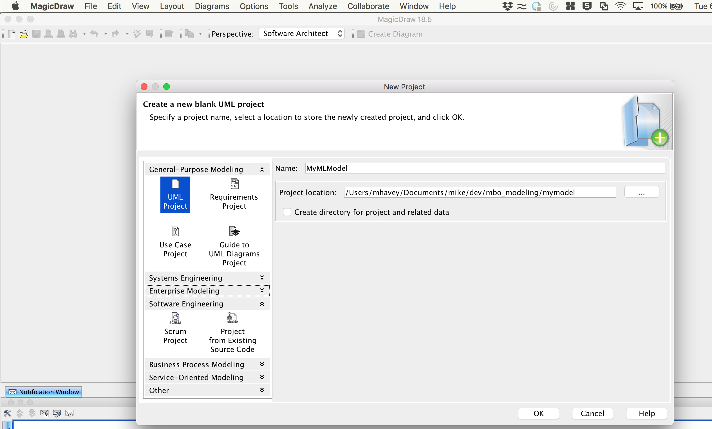

Click OK to create the model. It opens up like this:

### Add the Profile

To use your new model with MarkLogic, you need to add the UML-to-Entity Service profile. In the Containment panel on the left, select "Model". Then from the File menu, select Use Model - Local Model. 

In the Use Project dialog, under "Select Project To Use", select "From File System". Under "Project File", click on the button with three dots to find the profile in your filesystem. You should have a local clone of this toolkit. From that clone, choose the file [uml2es/umlProfile/magicdraw/MLProfile.xml](../umlProfile/magicdraw/MLProfile.xml). When you have found it, click Open. Your Use Model dialog should now look like this:

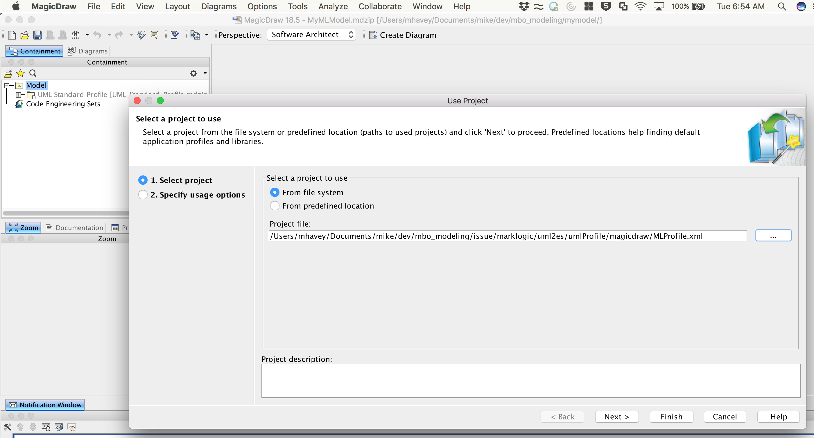

Click Next. You should see that MagicDraw recognizes the MarkLogic Entity Services Profile.

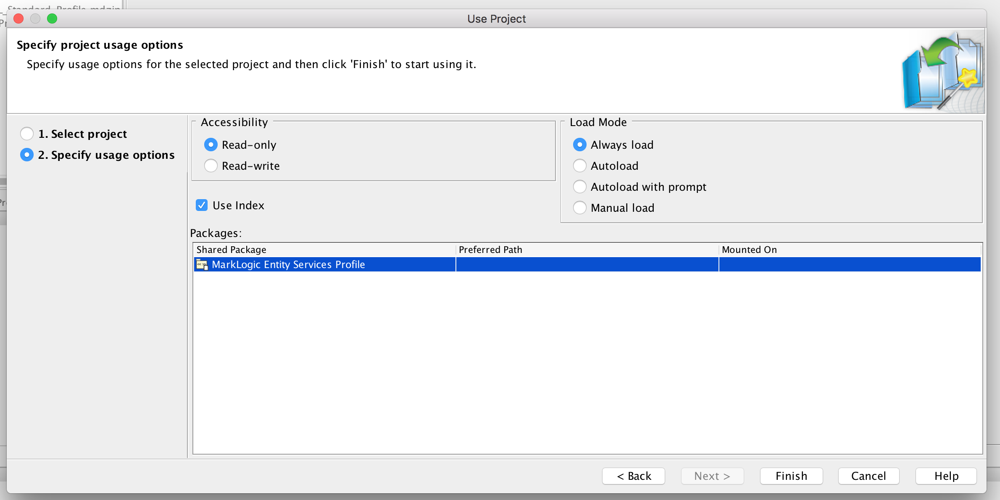

Keep the defaults and click Finish.

You now see the MarkLogic Entity Services Profile in the containment panel. The profile is loaded and ready to use.

### Building a Simple Model

In the Containment panel, right-click on Model and select New Diagram. 

From the Create Diagram popup select Class Diagram.

A new diagram is created with the default name Model. 

Rename it to MySimpleModel.

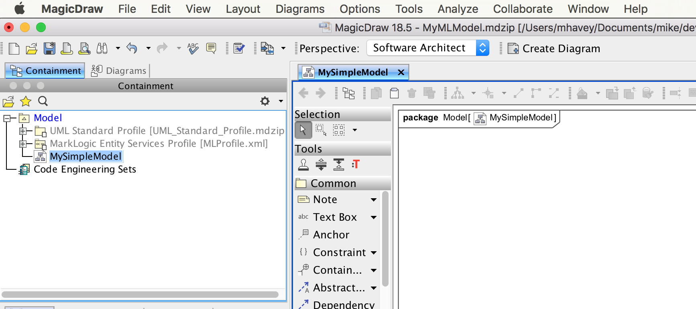

Let's add a class. In the diagram, drag a class onto the canvas. Name it Person.

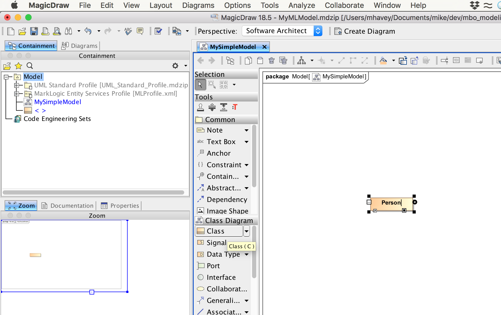

Double-click on the Person class to open its specification. Select the Attributes section.

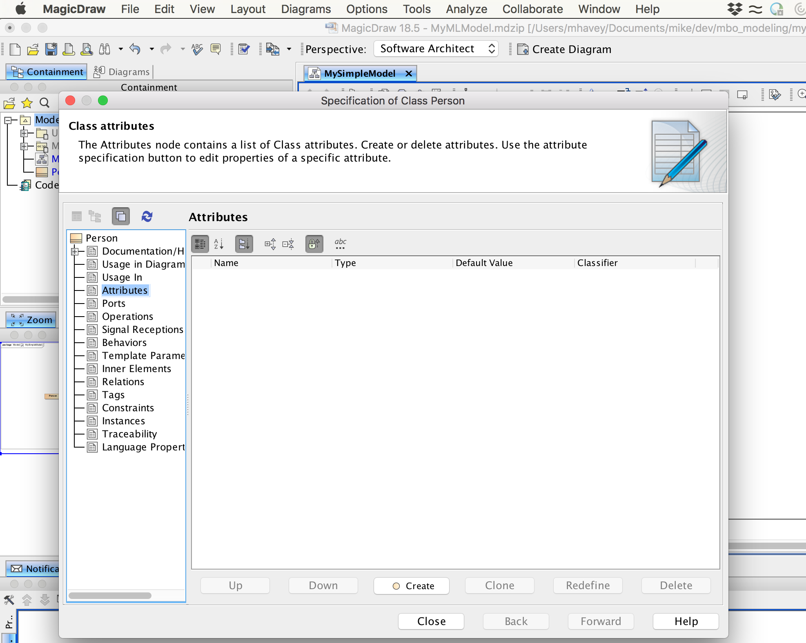

Let's add four attributes: id, firstName, lastName, hobbies. 

To create the id attribute, click Create. Configure it as follows:

- Name: id
- Type: String
- Multiplicity: 1

Your ID attribute dialog should look like this:

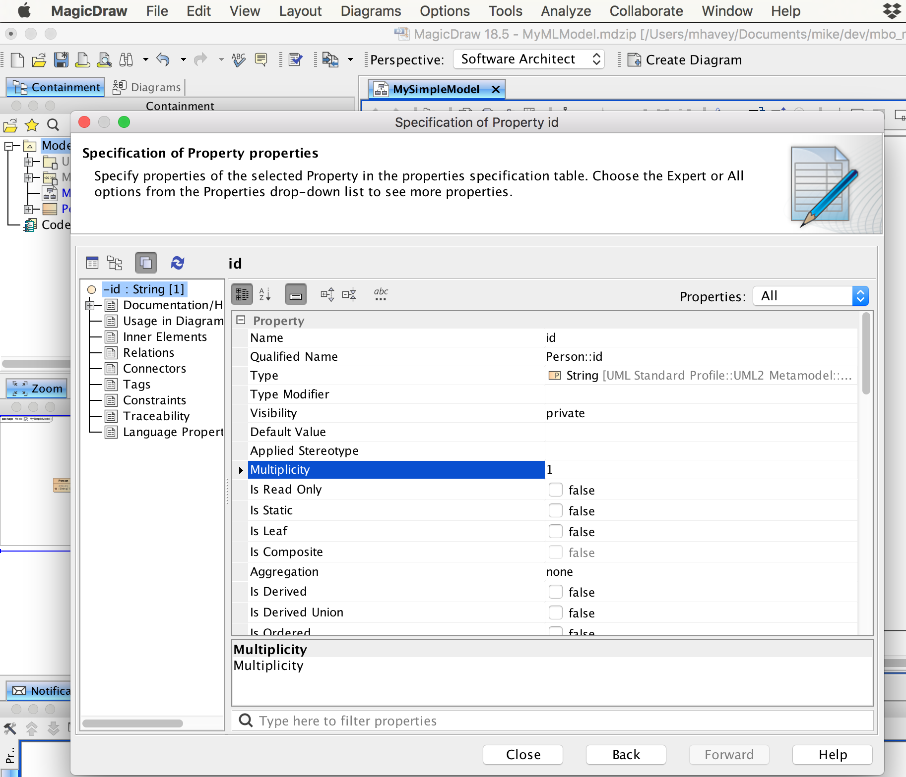

When done, click Back. This allows you to continue adding attributes.

Create the firstName, lastName, and hobbies attributes the same way you created id. For hobbies the multiplicity should be 0..*.

When done close the Specification dialog. Your model should look like this:

### Stereotyping the Model

To help map this to Entity Services, we'll add a few stereotypes to our model. 

- We will make the id attribute a primary key. To do this, double-click on the attribute to bring up the specification for id. Under Applied Stereotype, select PK and click Apply.

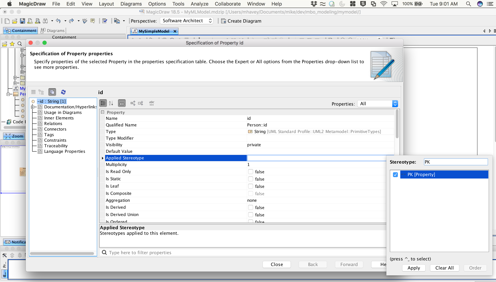

- We will add a range index on firstName, lastName, and hobbies. For each of these attributes, double-click on the attribute and under Applied Stereotype select elementRangeIndex and click Apply,

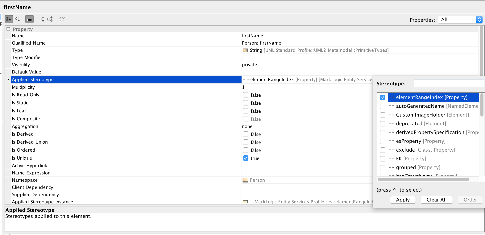

- We will give our model a version and a namespace. In the Containment panel on the left, double-click on Model to open its specification. Under Applied Stereotype select esModel and click Apply. Then in the Tags section, find <<esModel>>. Under this you see two tags: baseUri and version. Select each, click Create Value, enter a value on the right, and click Close. For tag values use http://xyz.org/marklogicModels for baseUri and 1.0.0 for version.

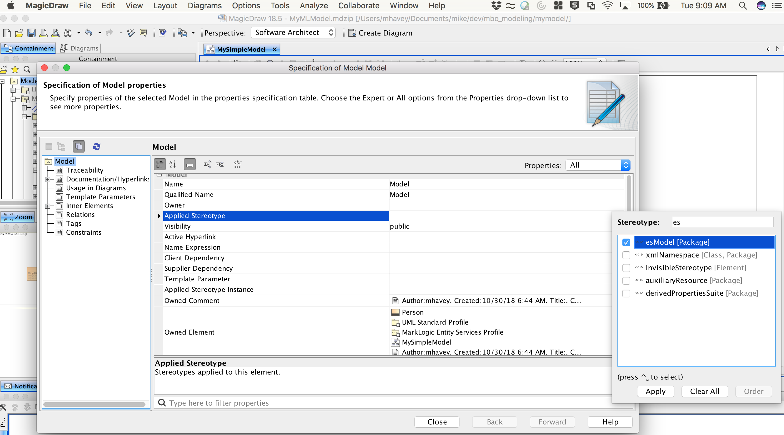

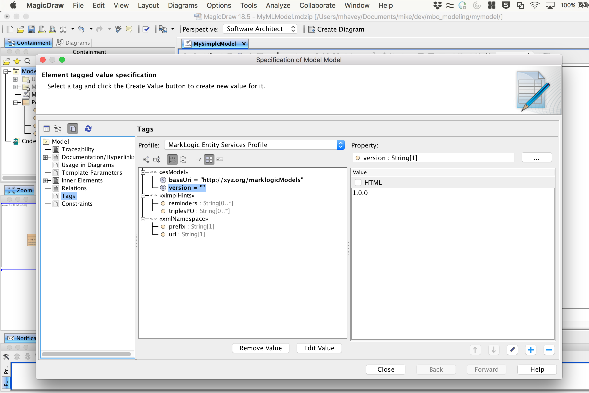

When done, your tags should look like this:

Your diagram should look like this:

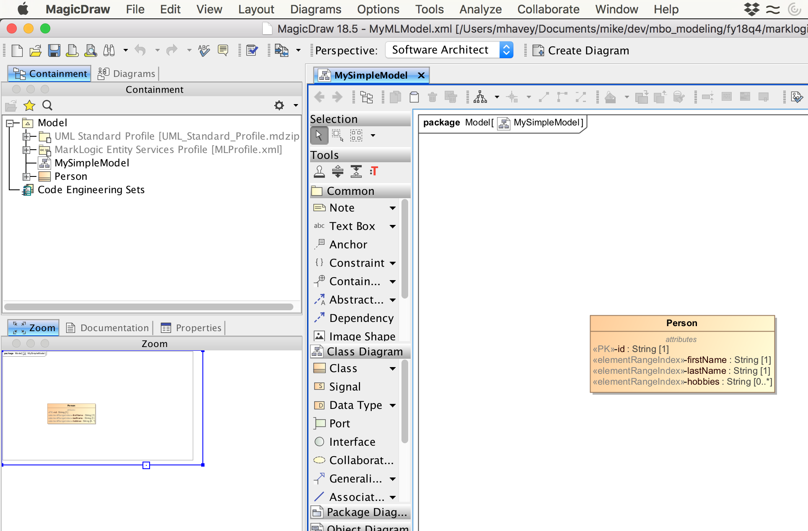

### Moving the Model Into MarkLogic

The UML-to-Entity Services toolkit will transform your MagicDraw UML model into the Entity Services form expected by MarkLogic. Save your model as an XML document by selecting File | Save Project as Other Type from the menu. Under file type, choose eXtensible Markup Language (XML). Save your file. 

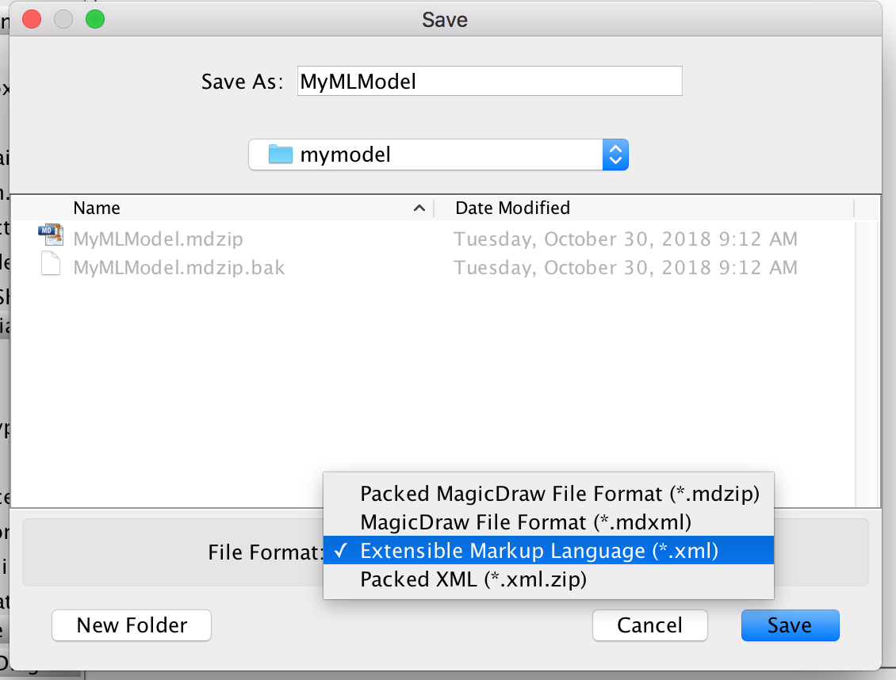

You now follow the same approach as the numerous [examples](../examples) of this toolkit. You use a gradle project to ingest your model to MarkLogic and convert it to Entity Services. For this tutorial, use the gradle project in [uml2es/tutorials/gradle](gradle) directory of your local clone. You first need to setup a database and deploy the transform. 

- The first step is to review and modify gradle.properties; set suitable values for hostname, ports, username/password, and application name. 
- Setup your database and deploy the transform by running: ./gradlew -i setup mlDeploy
- Load your model by running ./gradlew -b uml2es.gradle -i -PmodelFile=full-path-to-your-umlproject/MyMLModel.xml uDeployModel
- In QueryConsole explore the database xmi2es-tutorial-content. Your Entity Services descriptor is /xmi2es/es/MyMLModel.json (or /marklogic.com/entity-services/models/MyMLModel.json). Notice how it aligns with the MagicDraw model:

