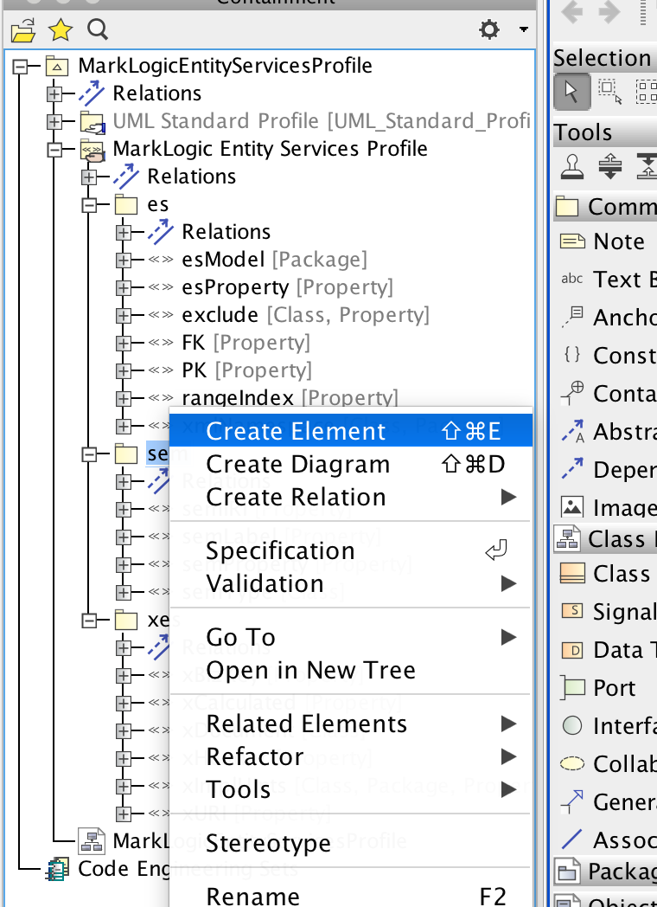
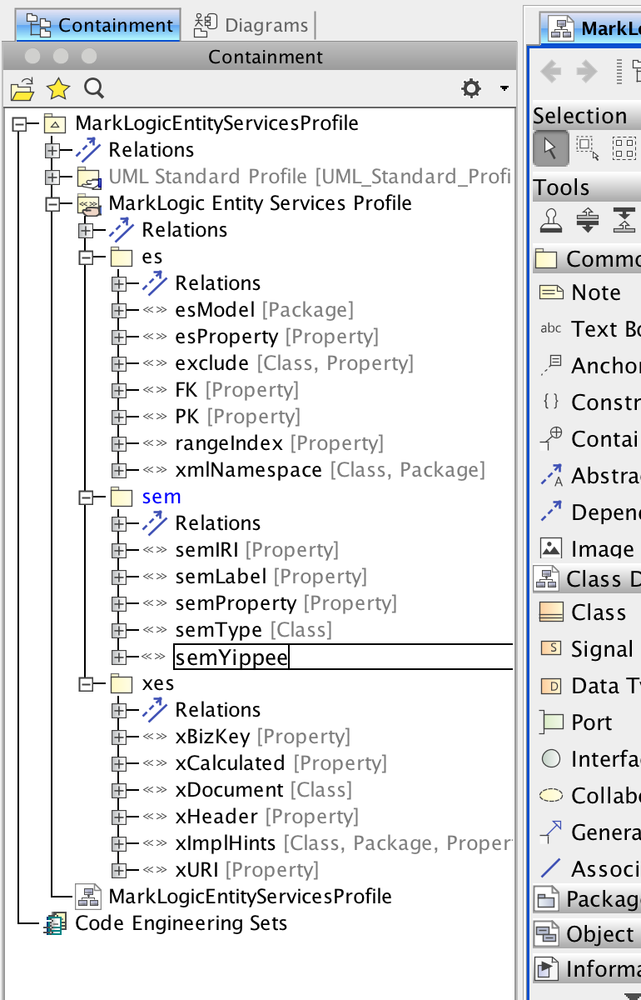
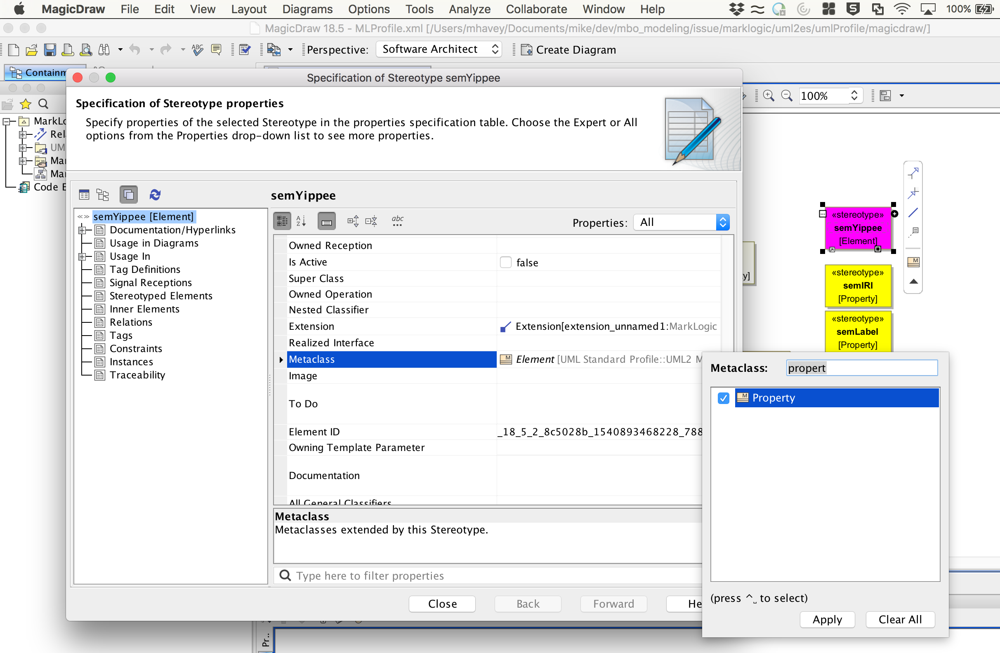
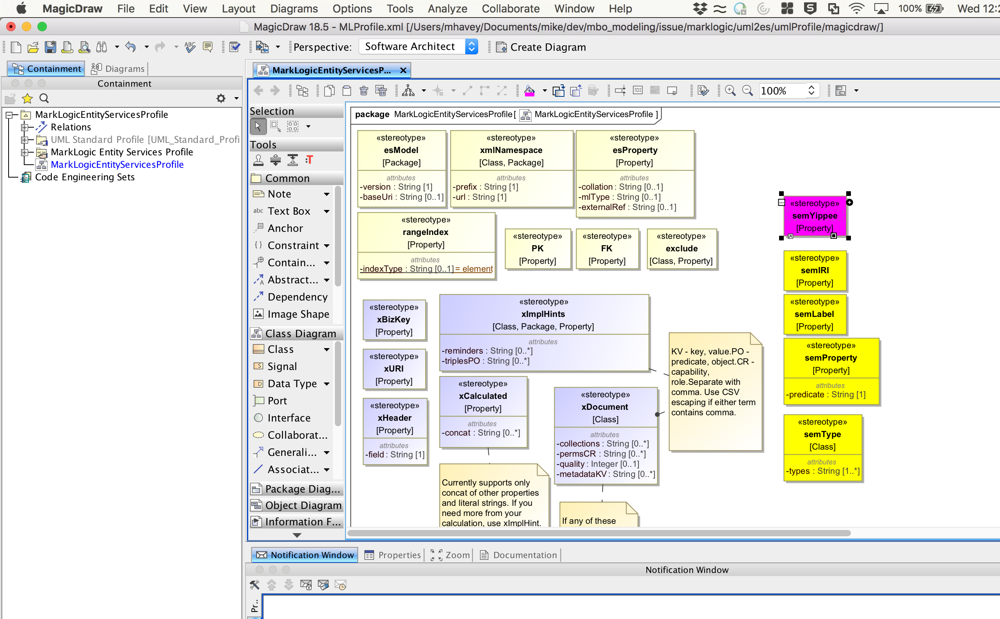

# How To Edit the UML-to-Entity Services Profile in MagicDraw

## Intro
This tutorial shows how to edit the UML-to-Entity Services profile in MagicDraw. I tested this on MagicDraw Enterprise 18.5 SP2. 

You probably don't need to modify the profile, unless you need to add new stereotypes. Before you do this, bear in mind:
- The profile has an xImplHint stereotype in which you can embellish your model with a limitless set of general hints.  Will xImplHint suit your purpose, or do you still need to add your own stereotypes?
- If you add stereotypes, you will also need to modify the code of the transform module to process that stereotype ... unless the stereotype is merely for diagrammatic purposes.

We recommend you open an Issue with your enhancement request rather than editing the profile yourself.

## How to edit the profile:

### Open the profile

Open MagicDraw. Close any existing projects: File | Close All Projects

Open the profile by selecting File | Open Project from the menu. Select the following file from your local clone of this repo: [uml2es/umlProfile/magicdraw/MLProfile.xml](../umlProfile/magicdraw/MLProfile.xml). Click Open. The profile opens in MagicDraw. It should look like this:

If it opens full-screen, right-click on the diagram's title bar ("MarkLogicEntityServiceProfile") and deselect Show Full Tabs On Screen.

### Editing the profile

In the left panel, select Containment. Expand MarkLogic Entity Services Profile. You see the stereotype structure for this profile. Notice it is divided into three subpackages: es, sem, xes.

Let's add a new stereotype to the sem subpackage. First, right-click on sem and select Create Element.

In the New Element popup, select Stereotype.

MagicDraw creates a new stereotype called unnamed1. 

You can name it. Just type in your name. Here we name it semYippee.

The stereotype exists, but you need to drag it from the Containment panel into the diagram to the right. Here we drag it just above semIRI.

If you want to add tagged values to your new stereotype, double-click on your new stereotype in the diagram. In the Specification dialog, select Tag Definitions. 

You should decide whether the stereotype applies to UML packages, classes, properties, or some combination of these. Let's configure semYippee to apply to properties. Double-click on the stereotype to open its specification. Select Metaclass, click the 3-dotted button, deselect Element and then select Property. 

### Saving the profile

When you are done editing, save the profile by selecting File | Save Project from the menu. MagicDraw saves it to [uml2es/umlProfile/magicdraw/MLProfile.xml](../umlProfile/magicdraw/MLProfile.xml). 

You can use that profile for your MagicDraw models, but if you want the profile to be available to other UML tools, such as Papyrus, you should export as an XMI profile document. MagicDraw supports multiple representations; we'll use Eclipse XMI. From the File menu, choose Export To | Eclipse UML2 XMI File | Eclipse UML2 (v5.x) XMI File.

You will be asked to provide a directory to save the exported files to. Note that MagicDraw produces SEVERAL files during this export. Keep the default directory name mlProfileEclipseProject5. Save under your [uml2es/umlProfile/magicdraw](../umlProfile/magicdraw) directory. We'll use only one of the files in the new mlProfileEclipseProject5 directory. It is MarkLogic_Entity_Services_Profile.profile.uml. Copy it to the following location, overwriting the file that is already there: [uml2es/umlProfile/MLProfile.xml](../umlProfile/MLProfile.xml). 

Also, copy this file to [uml2es/umlProfile/eclipse/MLProfileProject](../umlProfile/eclipse/MLProfileProject) and rename it to MLProfile.profile.uml, overwriting the existing file. 

As a result of all this, you just updated the profile in two forms:

- MagicDraw form, to [uml2es/umlProfile/magicdraw/MLProfile.xml](../umlProfile/magicdraw/MLProfile.xml)
- Generalized XMI form, to [uml2es/umlProfile/MLProfile.xml] (../umlProfile/MLProfile.xml)
- Generalized XMI form for Eclipse development, to [uml2es/umlProfile/eclipse/MLProfileProject/MLProfile.profile.uml] (../umlProfile/eclipse/MLProfileProject/MLProfile.profile.uml)

If you run the Papyrus tutorials, you'll need the last of these.

