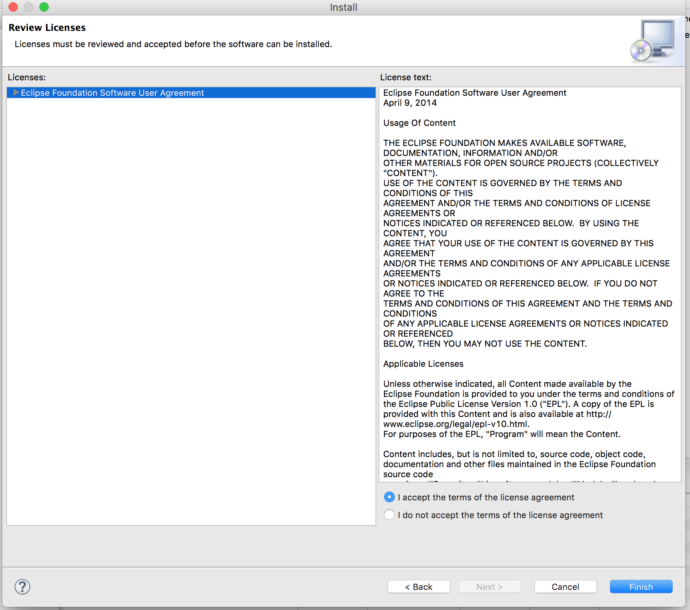
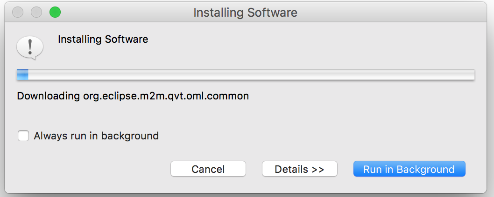
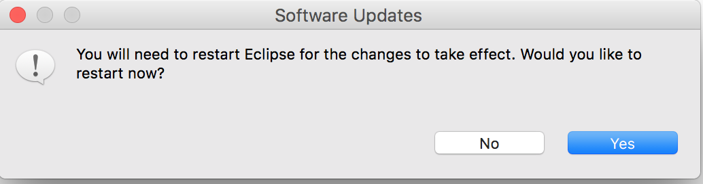

# How To Install Papyrus UML

First, install a recent version of Eclipse. I installed Neon. 

Next, install Papyrus. In Eclipse, go to the Help menu and select Install New Software. Under "Work With", select your version of Eclipse; I chose "Neon - http://download.eclipse.org/releases/neon".  Then in the text bar where it says "type filter text" type "Papyrus UML". Select "Papyrus UML" from the list. 

Click Next. In the Install Details page, review the list of items to be installed. It looks like this.

Click Next. In the Review Licenses Page, spend a few hours reviewing the license, then select "I accept" and click Finish.

Eclipse will spend the next few minutes installing Papyrus. You will see a progress bar that looks like this. Leave it alone. Let it finish.

You will be promted to restart Eclipse. Click yes.

