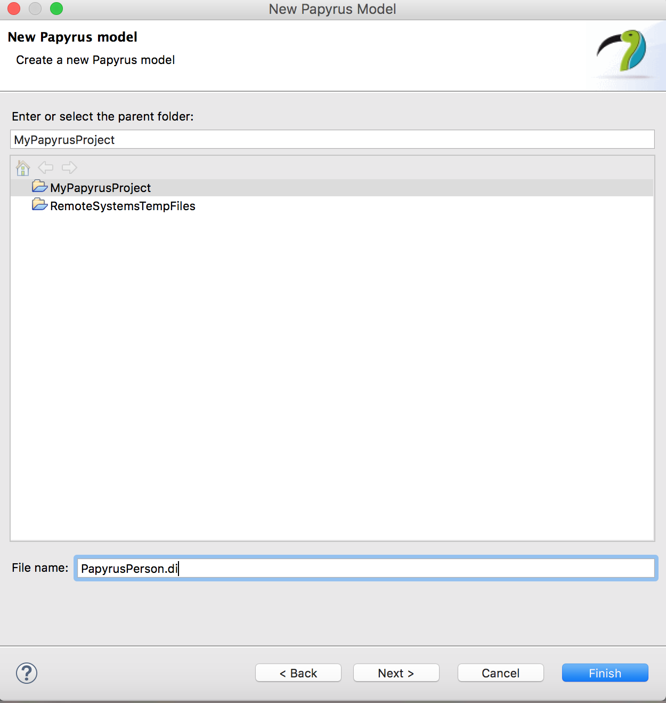
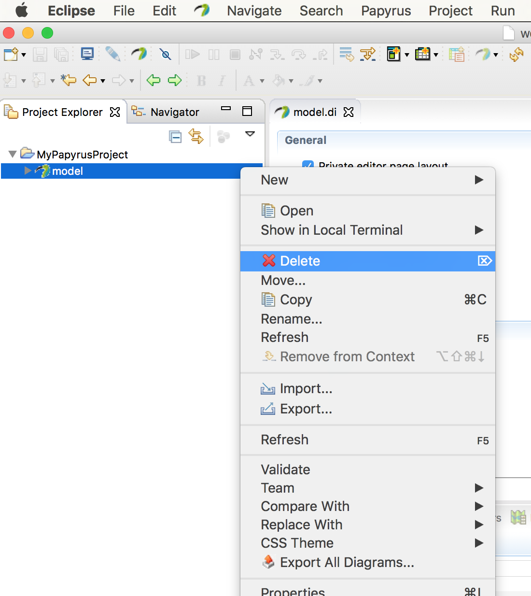
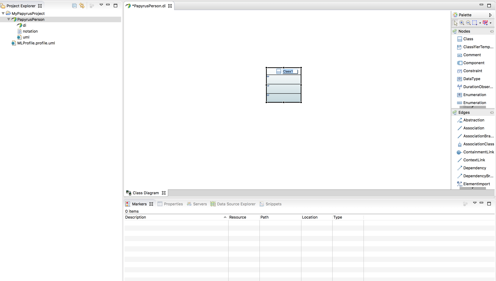
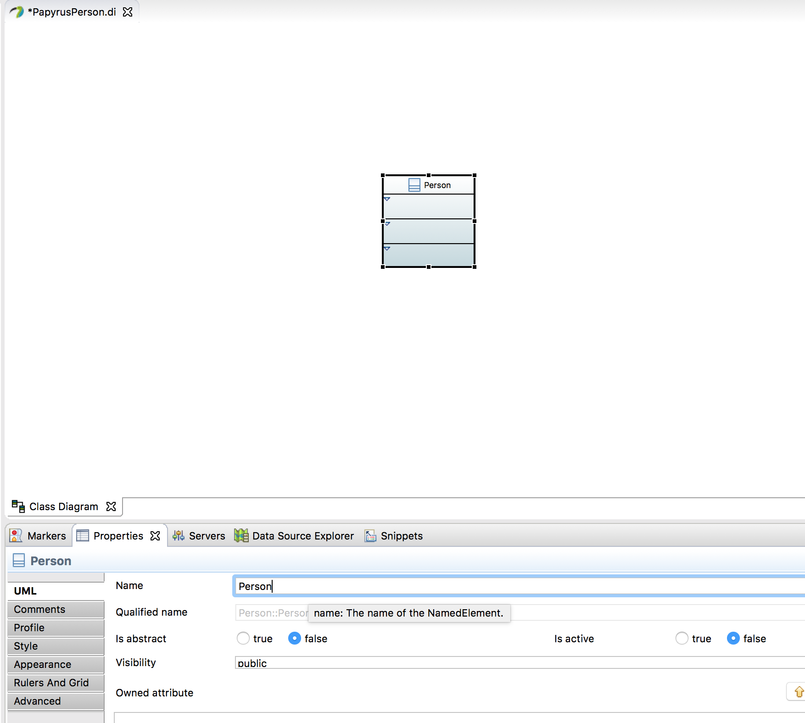
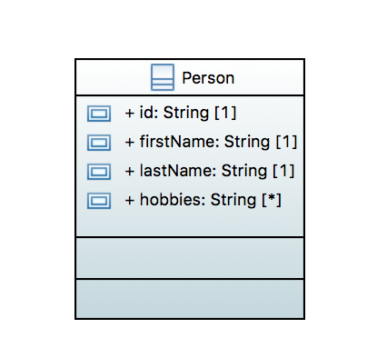
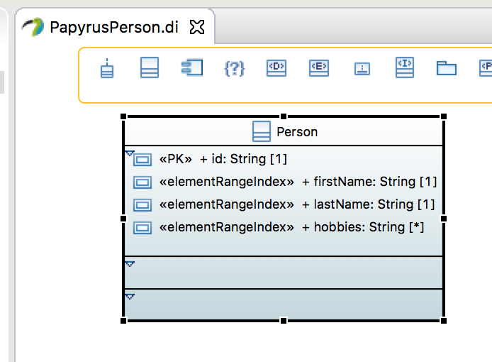
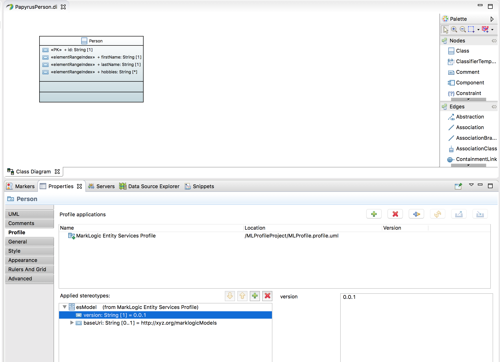
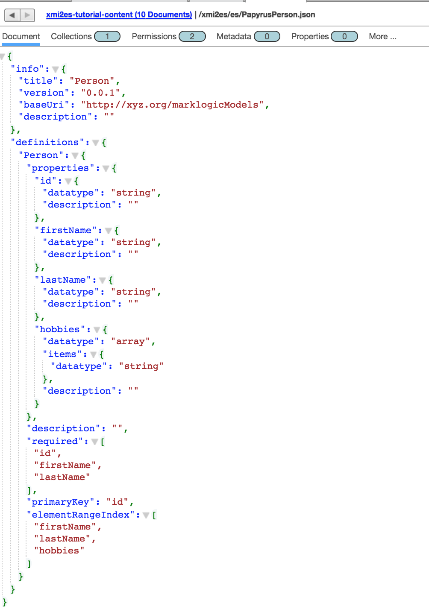

# How To Build a Model in Papyrus for MarkLogic

## Intro
This tutorial shows how to create a UML model for MarkLogic in Papyrus. To run this, you need Papyrus installed in Eclipse.  See [How to install Papyrus](papyrus_install.md) for instructions.

## How to create the model:

### Import profile
To use your new model with MarkLogic, you need to add the UML-to-Entity Service profile. The profile is provided in an Eclipse project in your local copy of the toolkit at (../umlProfile/eclipse/MLProfileProject/MLProfile.profile.uml). If you completed, the tutorial [How to edit the profile in Papyrus](papyrus_profile_edit.md), you modified that profile. 

To import, from the File menu select Import | General | Existing Projects Into Workspace. 

Click Next. In the Import Projects dialog, make sure "Select root directory" is selected. Use the Browse button to locate the ML profile Eclipse project in your local copy of the toolkit. It can be found in [uml2es/umlProfile/eclipse/MLProfileProject](../umlProfile/eclipse//MLProfileProject). 

Click Finish. You should now see the project in the Project Explorer pane in the upper-right corner of Eclipse.

### Create a new project

Open Eclipse. From the File menu choose New | Other. From the Select wizard, choose Papyrus project.

Click Next. In the Diagram Language window, select UML.

Click Next. In the next window enter the project name as MyPapyrusProject.

Click finish.

In Project Explorer, you will see the new project. Papyrus created a dummy model for you called model. Delete it by right-clicking on it and selecting Delete.

### Building a Simple Model

In Project Explorer, right-click on Model and select New | Other. In the selection wizard screen select "Papyrus Model". 

Click Next. For diagram language, select UML.

Click Next. For filename, enter PapyrusPerson.di

In the next page, for "Root model element name" type Person. For "Diagram Kind", select Class Diagram. Check "A UML Model With Primitive Types". For "Choose a profile to apply" click Browse Workspace. Select MLProfileProject/MLProfile.profile.uml.

Click Finish..

You will now see the PapyrusPerson canvas open in the center panel. From the Palette on the right class, choose Class. Drag it onto the canvas. It creates a class called Class1.

In the bottom panel, select Properties. Change the name of the class to Person.

In the canvas, hover over the Person class. From the bar select Add Property Class Attribute Label.

It creates an attribute called Attribute1. Select the attribute and in the properties change the name to "id" and the type to String (under UML Primitives).

Create three additional attributes. Name them firstName, lastName, and hobbies. Make each a String. The multiplicity of each should be 1, except hobbies, which should have multiplicity 0..*. When done, your model should look like this:

### Stereotyping the Model

To help map this to Entity Services, we'll add a few stereotypes to our model. 

First we will make the id attribute a primary key. To do this, select the id attribute. In the Properties panel select Profile. Click the + button above Applied Stereotypes. From the list of applicable stereotypes select PK and click the arrow to move it to Applied Stereotypes.

Click OK. The class now looks like this.

Using a similar approach, add the elementRangeIndex stereotype to firstName, lastName, and hobbies. Your class now looks like this:

We will give our model a version and a namespace. Click in a blank part of the canvas. Under Properties select Profile. Under Applied Stereotype click the +. (If you can't see Applied Stereotypes, make the properties panel larger.) Under Applicable Properties select esModel and click the arrow button to move it to Applied Properties.

Click OK. Back in the Properties panel, you see the esModel has been added. Expand it, click on version. In the right text box type 0.0.1.

Similarly for baseUri enter the value http://xyz.org/marklogicModels.

We are done modelling. Click File | Save All.

### Moving the Model Into MarkLogic

The UML-to-Entity Services toolkit will transform your Papyrus UML model into the Entity Services form expected by MarkLogic.
You now follow the same approach as the numerous [examples](../examples) of this toolkit. You use a gradle project to ingest your model to MarkLogic and convert it to Entity Services. For this tutorial, use the gradle project in [uml2es/tutorials/gradle](gradle) directory of your local clone. You first need to setup a database and deploy the transform. 

- The first step is to review and modify gradle.properties; set suitable values for hostname, ports, username/password, and application name. 
- Setup your database and deploy the transform by running: ./gradlew -i setup mlDeploy
- Load your model by running ./gradlew -b uml2es.gradle -i -PmodelFile=full-path-to-your-umlproject/PapyrusPerson.uml uDeployModel
- In QueryConsole explore the database xmi2es-tutorial-content. Your Entity Services descriptor is /xmi2es/es/PapyrusPerson.json (or /marklogic.com/entity-services/models/PapyrusPerson.json). Notice how it aligns with the Papyrus model:
 

