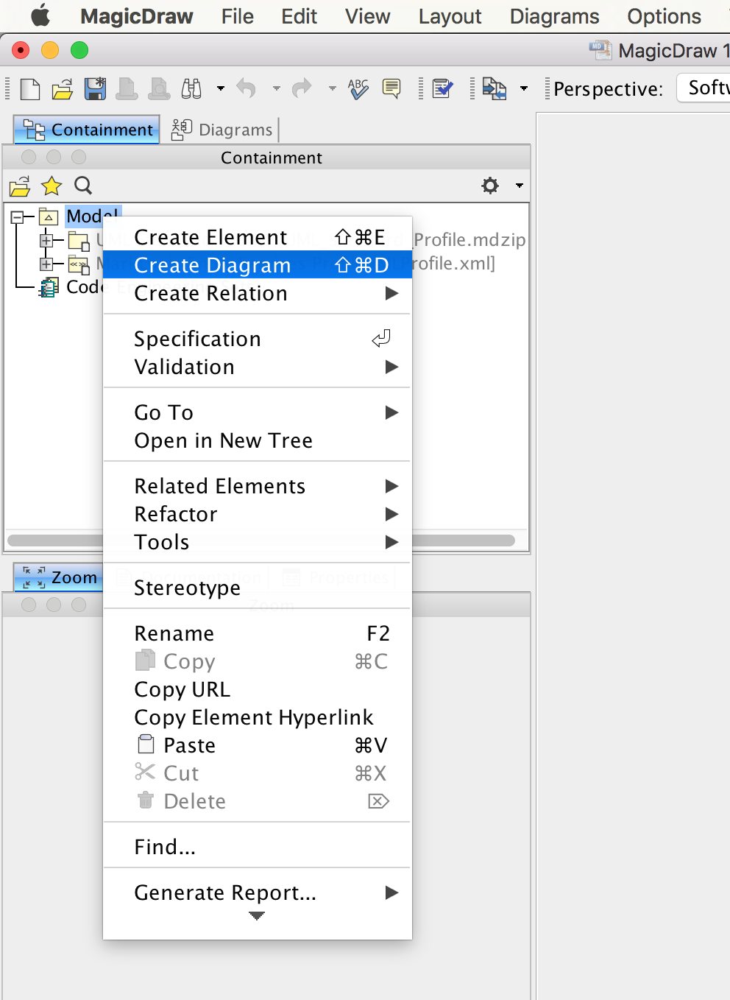
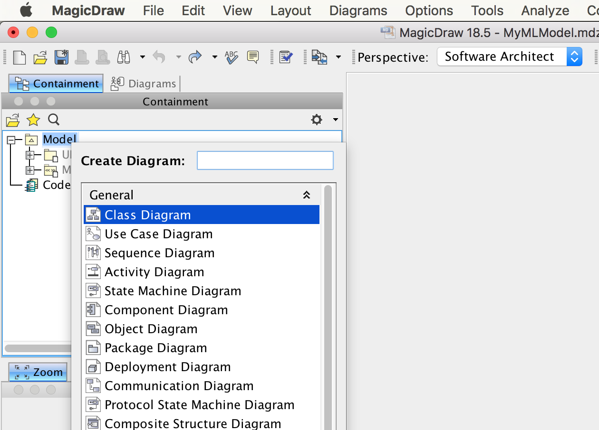
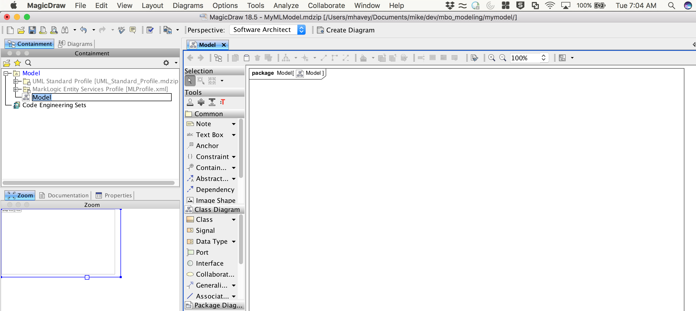
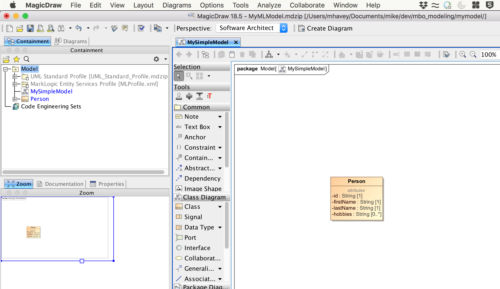
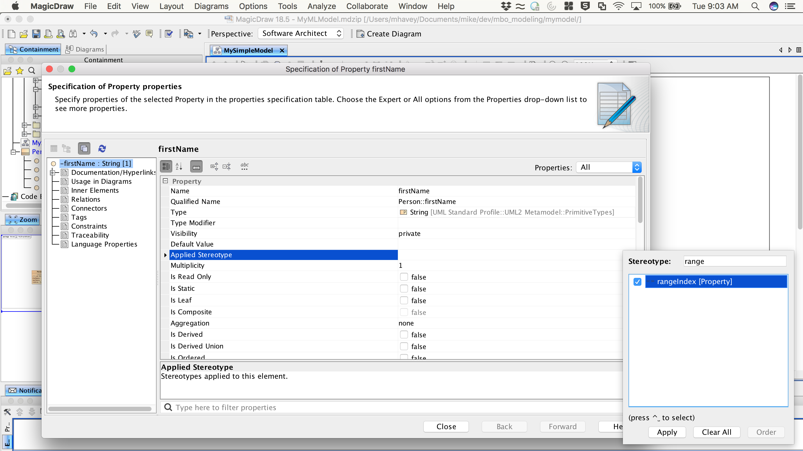
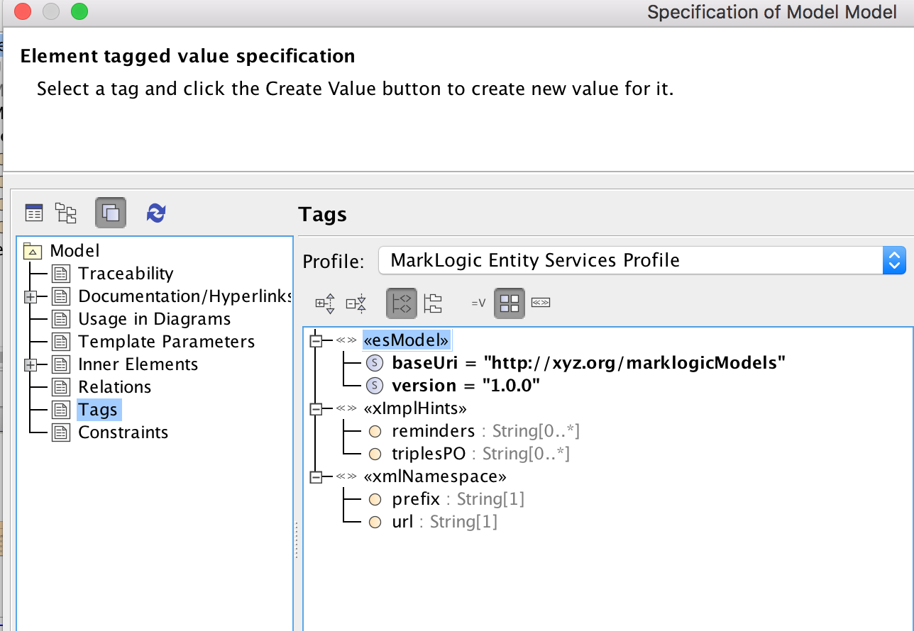
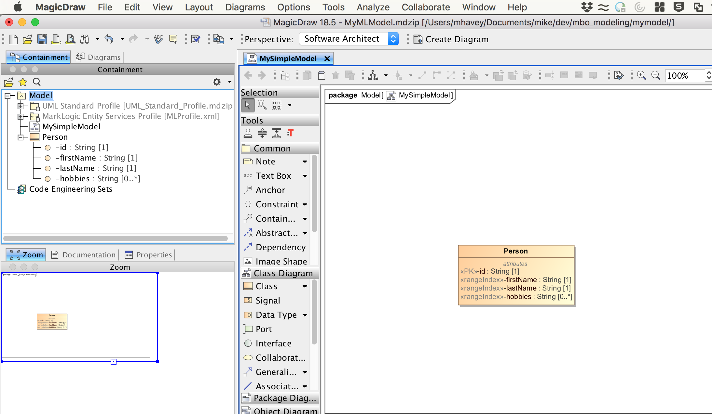
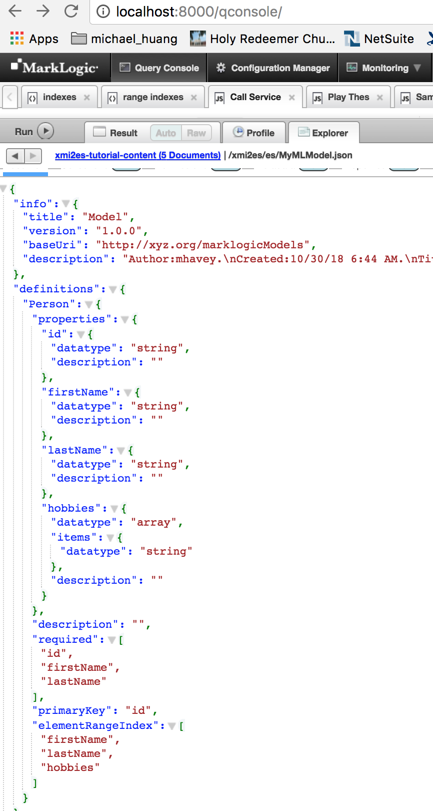

# How To Build a Model in Papyrus for MarkLogic

## Intro
This tutorial shows how to create a UML model for MarkLogic in Papyrus. To run this, you need Papyrus installed in Eclipse.  See [How to install Papyrus](papyrus_install.md) for instructions.

## How to create the model:

### Create a new project

Open Eclipse. From the File menu choose New | Other. From the Select wizard, choose Papyrus project.

Click Next. In the Diagram Language window, select UML.

Click Next. In the next window enter the project name as MyPapyrusProject.

Click finish.

In Project Explorer, you will see the new project. Papyrus created a dummy model for you called model. Delete it by right-clicking on it and selecting Delete.

### Add the Profile

To use your new model with MarkLogic, you need to add the UML-to-Entity Service profile. You can use the one provided in the toolkit, or if you completed the tutorial [How to edit the profile in Papyrus](papyrus_profile_edit.md), you can use its profile!

#### Using the Profile From the Toolkit

Import into the project the MLProfile.xml file that is in your local clone of the toolkit. The location is uml2es/umlProfile/MLProfile.xml. Do NOT use the MagicDraw file at uml2es/umlProfile/magicdraw/MLProfile.xml. To import, in Project Explorer right-click on the project name. From the context menu, select Import.

From the Import window, choose General | File System.

Click Next. In the next window, in the text box "From directory", enter the full path of the directory that contains the profile. Then in the right panel, select MLProfile.xml. 

Click Finish.

Rename the file to MLProfile.profile.uml by right-clicking on the file and selecting Rename.

#### Using the Profile From the Tutorial

If you completed the tutorial [How to edit the profile in Papyrus](papyrus_profile_edit.md), you have a modified version of the profile with a new stereotype called semYippee! To use that profile, in Project Explorer right-click on the project name. From the context menu, click Import.

From the Import window, choose General | File System.

Click Next. In the next window, in the text box "From directory", enter the full path of the Eclipse project you used in the tutorial. Then in the right panel, select MLProfile.profile.uml.

Click Finish.

### Building a Simple Model

In the Containment panel, right-click on Model and select New Diagram. 

From the Create Diagram popup select Class Diagram.

A new diagram is created with the default name Model. 

Rename it to MySimpleModel.

Let's add a class. In the diagram, drag a class onto the canvas. Name it Person.

Double-click on the Person class to open its specification. Select the Attributes section.

Let's add four attributes: id, firstName, lastName, hobbies. 

To create the id attribute, click Create. Configure it as follows:

- Name: id
- Type: String
- Multiplicity: 1

Your ID attribute dialog should look like this:

When done, click Back. This allows you to continue adding attributes.

Create the firstName, lastName, and hobbies attributes the same way you created id. For hobbies the multiplicity should be 0..*.

When done close the Specification dialog. Your model should look like this:

### Stereotyping the Model

To help map this to Entity Services, we'll add a few stereotypes to our model. 

- We will make the id attribute a primary key. To do this, double-click on the attribute to bring up the specification for id. Under Applied Stereotype, select PK and click Apply.

- We will add a range index on firstName, lastName, and hobbies. For each of these attributes, double-click on the attribute and under Applied Stereotype select rangeIndex and click Apply,

- We will give our model a version and a namespace. In the Containment panel on the left, double-click on Model to open its specification. Under Applied Stereotype select esModel and click Apply. Then in the Tags section, find <<esModel>>. Under this you see two tags: baseUri and version. Select each, click Create Value, enter a value on the right, and click Close. For tag values use http://xyz.org/marklogicModels for baseUri and 1.0.0 for version.

When done, your tags should look like this:

Your diagram should look like this:

### Moving the Model Into MarkLogic

The UML-to-Entity Services toolkit will transform your MagicDraw UML model into the Entity Services form expected by MarkLogic. Save your model as an XML document by selecting File | Save Project as Other Type from the menu. Under file type, choose eXtensible Markup Language (XML). Save your file. 

You now follow the same approach as the numerous examples of this toolkit. You use a gradle project to ingest your model to MarkLogic and convert it to Entity Services. For this tutorial, use the gradle project in uml2es/tutorials/gradle directory of your local clone. You first need to setup a database and deploy the transform. 

- The first step is to review and modify gradle.properties; set suitable values for hostname, ports, username/password, and application name. 
- Next copy your MagicDraw model that you saved in XML form above to the gradle directory. 
- Setup your database and deploy the transform by running: gradle -i includeXMI2ESTransform mlDeploy
- Load your model by running gradle -i loadXMI
- In QueryConsole explore the database xmi2es-tutorial-content. Your Entity Services descriptor is /xmi2es/es/MyMLModel.json. Notice how it aligns with the MagicDraw model:

